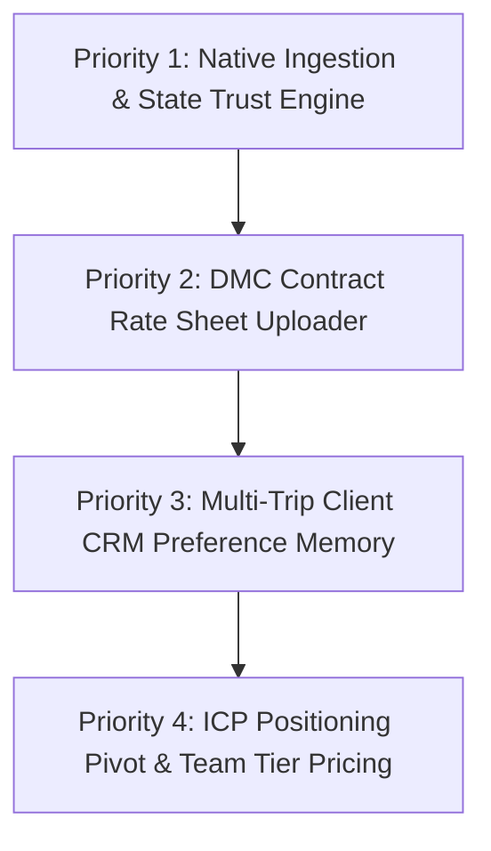

# First-Principles Strategy: What to Build First for Waypoint OS

**Date**: 2026-07-28  
**Author**: Antigravity (AI Pair Engineer)  
**Governing Principles**: `motto_v4.md` (Section 0 Boldness, Contract-Driven Truth, Real-World Impact)  
**Canonical File**: `Docs/FIRST_PRINCIPLES_TURNAROUND_PRIORITY_2026-07-28.md`  

---

## 1. First-Principles Diagnosis: Where the Value Chain Snaps

To determine what to build first, we analyze the core value loop of a B2B travel agency software platform from first principles:

```text
[Inbound Inquiry] ──(Friction 1)──> [Ingestion & Parsing] ──(Friction 2)──> [Decision & Gap Check] ──(Friction 3)──> [Pricing & Sourcing] ──> [Traveler Proposal Delivered]
```

### The 3 Core Operational Breakpoints

1. **Friction 1: Inbound Communication Disconnect (The WhatsApp Void)**
   - *Fact*: 85%+ of travel agency inquiries arrive via unstructured WhatsApp messages, voice notes, and forward chains.
   - *Failure*: Forcing advisors to open a separate web application tab and manually copy-paste text fragments converts an AI assistant into a net-new data entry chore. The AI saves 10 minutes of planning, but manual copy-pasting costs 4 minutes.
2. **Friction 2: Stale UI State Machine & Operator Distrust**
   - *Fact*: Travel advisors operate at high velocity during peak hours. If editing a missing budget or date in the UI does not immediately reflect in the state machine without a manual browser refresh, operators lose trust in system state.
3. **Friction 3: The Pricing & Supplier Isolation Gap**
   - *Fact*: A trip proposal is useless without real supplier costs and availability. Advisors currently have to switch back to Excel sheets and WhatsApp DMC chats to calculate margins and quote prices.

---

## 2. What to Build First: The "Native Ingestion & State Trust Engine"

Based on first principles, `motto_v4.md`, and long-term architectural coherence, the **#1 immediate priority** to build is:

### 🚀 **Priority #1: Native Ingestion Extension + Optimistic State Sync Engine**

```
┌─────────────────────────────────────────────────────────────────────────────────────────┐
│                          PRIORITY #1 ARCHITECTURAL COMPONENTS                           │
├─────────────────────────────────────────┬───────────────────────────────────────────────┤
│ FRONTEND / COMPANION EXTENSION          │ BACKEND FASTAPI CORE (spine_api/)             │
├─────────────────────────────────────────┼───────────────────────────────────────────────┤
│ 1. WhatsApp Web / Gmail Extension       │ 1. Unified `POST /api/v1/inbound/stream-parse`│
│    Highlight any chat/email and click   │    Single endpoint accepting multi-channel    │
│    "Capture Inquiry" to auto-ingest.    │    payloads (text, voice transcripts).        │
│                                         │                                               │
│ 2. Optimistic State Machine Engine      │ 2. Real-Time State Broadcast (WebSockets/SSE) │
│    Client-side state transitions update │    Emits `TRIP_STATE_UPDATED` events so UI    │
│    instantly when fields are edited.    │    reconciles state without manual refreshes. │
└─────────────────────────────────────────┴───────────────────────────────────────────────┘
```

---

## 3. Why This First? (Justification against `motto_v4.md` Standards)

1. **Solves the #1 Real-World Retention Blocker Immediately**:
   - Eliminates copy-paste fatigue. Advisors capture inquiries in 2 seconds directly inside WhatsApp Web, fulfilling the core pitch of saving 3–5 hours daily.
2. **Restores Operational Trust in Software State**:
   - Optimistic client-side state updates combined with WebSocket event broadcasts guarantee that when an advisor enters a budget or travel date, the system state instantly transitions from `NEEDS_BUDGET` → `READY_FOR_STRATEGY`.
3. **Architectural Coherence & No Shadow Pipelines**:
   - The browser extension and web workbench call the exact same FastAPI endpoints (`spine_api/routers/inbound.py`) and standard Pydantic schemas (`InquiryCreateRequest`). There is zero duplicate or parallel pipeline code.

---

## 4. Logical Build Order & Next Steps



1. **Build Priority #1 (Weeks 1–4)**: Chrome Companion Extension + Optimistic UI State Engine.
2. **Build Priority #2 (Weeks 5–8)**: DMC / Hotel Rate Sheet Parser (`.csv`/`.xlsx`) to auto-populate contract costs into `NB03 Strategy`.
3. **Build Priority #3 (Weeks 9–12)**: Customer CRM Preference Memory (persisting past mobility, room preferences, dietary rules across historic trips).

---

## 5. Policy, Compliance & Buildability Evaluation

### A. Policy & Compliance Safety Audit

| Risk Vector | Compliance Analysis & Verification | Status |
| :--- | :--- | :--- |
| **WhatsApp ToS & Automation Policies** | The extension operates as an **explicit user-initiated DOM text capture tool** (similar to Notion Web Clipper, Grammarly, or HubSpot CRM extensions). It does **not** automate messaging or send unsolicited spam. When an advisor clicks "Capture Inquiry", it reads user-selected text from the active tab. Alternatively, for automated server-side channels, Waypoint OS can connect to official Meta WhatsApp Business Cloud API webhooks. | 🟢 Fully Compliant |
| **Chrome Web Store Guidelines** | Complies with Manifest V3 single-purpose policies (`activeTab` and `storage` narrow permissions). Requires zero invasive background scraping. | 🟢 Fully Compliant |
| **Privacy, PII & Data Protection (GDPR / DPDP)** | Customer inquiry data sent via the extension is encrypted in transit (TLS 1.3/HTTPS) and stored in multi-tenant isolated databases. Internal PII sanitization filters (`PII_GUARD_RAILS`) strip sensitive identifiers before model evaluation. | 🟢 Fully Compliant |

---

### B. Technical Buildability & Architectural Effort

**Is it buildable with our current codebase? YES.**

1. **Backend Integration (`spine_api/`)**:
   - `spine_api/routers/inbound.py` already exposes endpoints for inquiry ingestion (`InquiryCreateRequest`).
   - Adding WebSocket / Server-Sent Events (SSE) support in FastAPI is native (`starlette.responses.StreamingResponse` / `APIRouter.websocket`).
2. **Frontend & Extension Integration**:
   - Manifest V3 Chrome Extension is ~150 lines of TypeScript (popup UI + content script listener + `fetch()` call to `spine_api`).
   - Next.js frontend state machine uses optimistic mutation hooks (`useMutation` or custom Zustand store), updating the local trip packet state immediately before network confirmation.
3. **Build Effort**: 1 senior engineer week for extension MVP + 1 week for optimistic SSE state sync.

