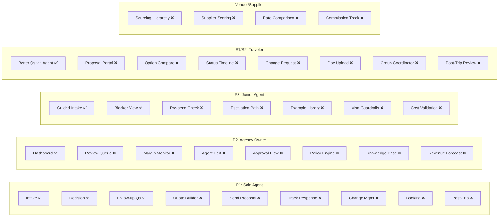
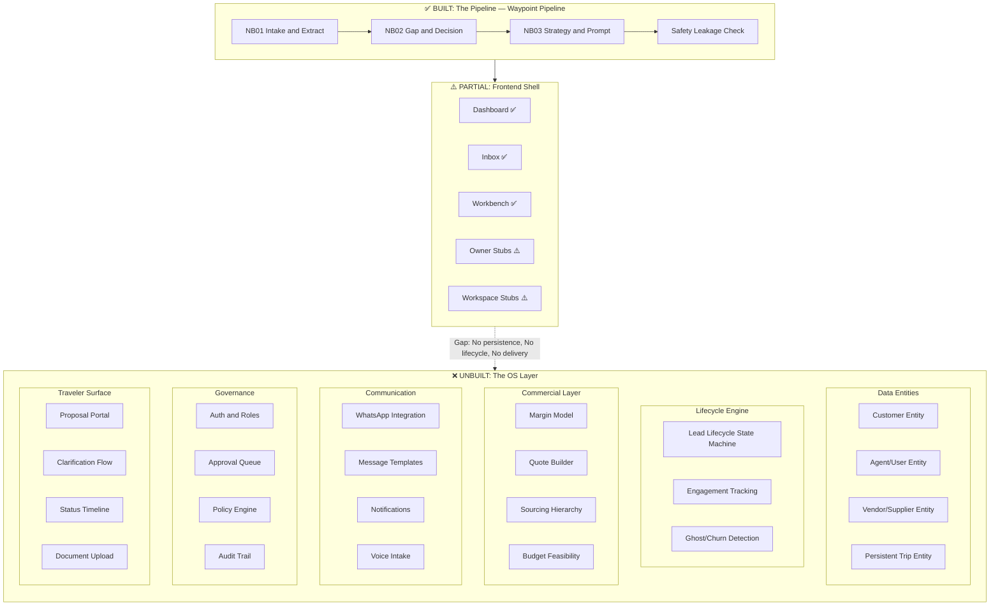
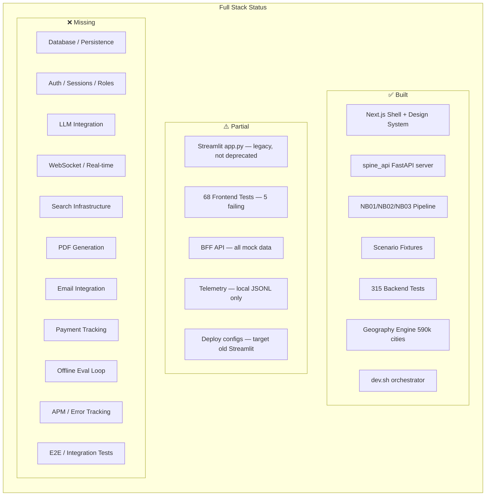
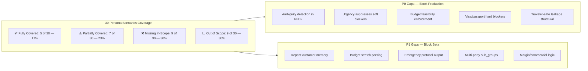

# Persona-Driven Process Gap Analysis — Waypoint OS

**Date:** 2026-04-16  
**Method:** Simulated day-in-the-life walkthrough of each persona against actual system capabilities (backend pipeline + frontend + docs)  
**Sources:** All persona docs, scenario coverage gaps, UX flows, JTBD, message templates, lifecycle model, sourcing policy, voice orchestration, design refs, and actual codebase  

---

## Executive Summary

| Persona | Processes Documented | Processes Built | Processes Working E2E | Gap Severity |
|---------|---------------------|-----------------|----------------------|--------------|
| **P1: Solo Agent** | 25+ workflows | 5 | 3 | 🔴 Critical |
| **P2: Agency Owner** | 20+ workflows | 2 | 0 | 🔴 Critical |
| **P3: Junior Agent** | 15+ workflows | 3 (same as P1) | 2 | 🟠 High |
| **S1/S2: Traveler/Coordinator** | 15+ workflows | 1 | 0 | 🔴 Critical |
| **Team Operations** | 10+ workflows | 0 | 0 | 🔴 Critical |
| **Vendor/Supplier** | 8+ workflows | 0 | 0 | 🟡 Medium (P2) |

**Bottom line:** Waypoint OS has deeply thought-out persona documentation (the richest I've seen in any codebase), but only the narrow "happy path" of intake→decision→strategy for a single well-structured inquiry is functional. Everything around it—lifecycle, multi-agent, owner oversight, vendor management, communication, and operations—is documented but unbuilt.

---

## 🧑‍💼 PERSONA 1: THE SOLO AGENT (P1)

### Day-in-the-Life Simulation

> *It's 10 AM. Priya has 12 WhatsApp conversations open, 3 new inquiries from last night, and needs to send a proposal to the Sharma family by noon.*

#### ✅ What Works Today

| Process | System State | Evidence |
|---------|-------------|----------|
| **Paste raw inquiry → Extract intent** | ✅ NB01 extracts facts, signals, ambiguities | `src/intake/extractors.py`, workbench IntakeTab |
| **See blockers & decision state** | ✅ NB02 produces DecisionState, blockers, confidence | `src/intake/decision.py`, workbench DecisionTab |
| **Generate follow-up questions** | ✅ NB03 builds question sequences | `src/intake/strategy.py`, workbench StrategyTab |
| **View traveler-safe vs internal split** | ✅ Safety leakage check works | `src/intake/safety.py`, workbench SafetyTab |
| **Run full pipeline on a scenario** | ✅ Workbench → Process Trip | `/api/spine/run`, `useSpineRun` hook |

#### ❌ What Breaks / Is Missing

| Process | What Priya Needs | System State | Impact |
|---------|-----------------|-------------|--------|
| **Customer recognition** | "I know the Sharmas — pull up their profile" | ❌ No `customer_id`, no history lookup, no repeat detection | Asks same questions again — looks unprofessional |
| **WhatsApp paste → auto-process** | Copy from WhatsApp, paste into system | ⚠️ IntakeTab has text area but inbox has hardcoded data | Manual only; no real data flow |
| **Trip-scoped workspace** | Click a trip in inbox, land in its workspace | ❌ Inbox links to `/workbench` not `/workspace/[tripId]` | Cannot work on individual trips |
| **Quote/proposal builder** | Generate 3 options with budget breakdown | ❌ No quote builder, no option generator, no pricing | Core JTBD #3 unmet |
| **Send proposal to client** | Copy for WhatsApp, share link, email PDF | ❌ No output delivery mechanism | Core JTBD #4 unmet |
| **Follow-up tracking** | "Did Mrs. Sharma reply? It's been 2 days" | ❌ No engagement tracking, no timeline | Ghost risk undetected |
| **Budget feasibility check** | "Is 3L realistic for 5 people in Maldives?" | ❌ No min-cost-per-destination logic (P0-3 gap) | Generates impossible proposals |
| **Urgency handling** | "They need to book THIS WEEKEND" | ❌ Urgency doesn't suppress soft blockers (P0-2 gap) | Wastes time on soft questions |
| **Ambiguity detection** | "Andaman or Sri Lanka" treated as definite | ❌ No value ambiguity check (P0-1 gap) | Proceeds on ambiguous data |
| **Change management** | "Client changed from Europe to Asia mid-plan" | ❌ No revision tracking, no change recovery flow | Starts over from scratch |
| **Document collection** | "Need passport copies from all 5 travelers" | ❌ No document tracking | Tracks manually in WhatsApp |
| **Cancellation handling** | "Client wants to cancel — what are the penalties?" | ❌ No cancellation policy engine | No financial impact analysis |
| **Post-trip follow-up** | "Sharmas returned yesterday — send review request" | ❌ No post-trip lifecycle | Misses retention opportunity |
| **Booking confirmation workflow** | "Everything approved — lock it in" | ❌ No booking readiness checks | No structured handoff to booking |

#### Priya's Verdict
> *"The system understands my client's message better than I expected. But then what? I can't generate a quote, I can't send it, I can't track if they responded, and I can't manage the 12 other trips I have open. It's a smart notebook, not an operating system."*

---

## 👔 PERSONA 2: THE AGENCY OWNER (P2)

### Day-in-the-Life Simulation

> *It's Monday 9 AM. Rajesh runs a 12-agent agency. He needs to review weekend work, check if junior Ramesh's quotes were acceptable, and see pipeline health.*

#### ✅ What Works Today

| Process | System State |
|---------|-------------|
| **Dashboard overview** | ✅ `/` shows stat cards, pipeline bar, recent trips |
| **See decision states** | ✅ Decision state legend on dashboard |

#### ❌ What Breaks / Is Missing

| Process | What Rajesh Needs | System State | Impact |
|---------|-----------------|-------------|--------|
| **Quote quality review** | "Show me all quotes sent this weekend — flag issues" | ❌ `/owner/reviews` is 8-line stub | Cannot quality-check agent work |
| **Margin monitoring** | "Are we making money on Ramesh's quotes?" | ❌ No margin model, no commercial logic | Revenue blind spot |
| **Agent performance dashboard** | "How many trips did each agent process? Average turnaround?" | ❌ `/owner/insights` is 8-line stub | No team visibility |
| **Approval workflow** | "Ramesh wants to offer 20% discount — approve/reject" | ❌ No approval queue, no policy governance | Uncontrolled discounting |
| **Training mode** | "Show Ramesh's last 5 decisions with corrections" | ❌ No training mode, no decision audit trail | Junior agents learn by trial and error |
| **Escalation center** | "Which trips are stuck? Who needs help?" | ❌ No escalation detection or routing | Problems discovered too late |
| **SLA tracking** | "Are we responding within 2 hours?" | ❌ No response time tracking | SLA violations invisible |
| **Customer churn analysis** | "Why did 3 clients book elsewhere this month?" | ❌ No win/loss tracking, no loss_reason | Cannot improve conversion |
| **Agent workload balancing** | "Priya has 20 trips, Ramesh has 5 — rebalance" | ❌ No workload distribution view | Uneven agent utilization |
| **Knowledge preservation** | "Priya just quit — what customer knowledge do we lose?" | ❌ No knowledge base, no customer memory | Business risk when agents leave |
| **Revenue forecasting** | "What's our expected revenue this month?" | ❌ No pipeline value tracking | Cannot plan or forecast |
| **Policy governance** | "Set minimum margin at 12% — alert if violated" | ❌ No policy engine | Rules are tribal knowledge |
| **Cross-trip analytics** | "Which destinations are most profitable? Conversion by type?" | ❌ No analytics infrastructure | Guesswork on strategy |

#### Rajesh's Verdict
> *"I can see a dashboard with numbers. But I can't review my team's work, I can't set policies, I can't see who's struggling, and I have zero commercial visibility. I'm still the bottleneck."*

---

## 🧑‍🎓 PERSONA 3: THE JUNIOR AGENT (P3)

### Day-in-the-Life Simulation

> *Amit is 3 months in. He just received his first solo inquiry and is nervous about messing up.*

#### ✅ What Works Today

| Process | System State |
|---------|-------------|
| **Guided intake** | ✅ System extracts facts, shows what's known/unknown |
| **Blocker visibility** | ✅ Hard vs soft blockers clearly shown |
| **Decision rationale** | ✅ "Why" behind decision state is explained |

#### ❌ What Breaks / Is Missing

| Process | What Amit Needs | System State | Impact |
|---------|----------------|-------------|--------|
| **"Is this right?" validation** | "Before I send, check my work" | ❌ No pre-send review mode | Mistakes reach client |
| **Confidence-gated actions** | "Low confidence → require senior approval" | ❌ No permission/approval gating | Junior can send bad proposals unsupervised |
| **Learning from examples** | "Show me how a senior handled this type of trip" | ❌ No example library, no template genomes | Learns only from own mistakes |
| **Visa/passport guardrails** | "Is a visa needed for Singapore for Indian passport?" | ❌ No visa requirement database | Books without checking visa |
| **Cost validation** | "Is ₹3L reasonable for this itinerary?" | ❌ No cost completeness validator | Under/over-prices quotes |
| **Escalation path** | "I'm stuck — escalate to senior" | ❌ No escalation workflow | Uses WhatsApp to ask senior |
| **Progressive disclosure** | More guidance early, less as confidence builds | ❌ Same UI for all experience levels | System doesn't adapt to skill |
| **Common mistake prevention** | "⚠️ You're about to quote 3x the client's budget" | ❌ No pre-send validation rules | Scenario P2-S1 (Ramesh's Marina Bay mistake) |

#### Amit's Verdict
> *"The system tells me what the client said, which is great. But it doesn't tell me if what I'm doing with that information is right. I still need my senior for every decision."*

---

## 🏖️ PERSONA S1/S2: TRAVELER & FAMILY COORDINATOR

### Day-in-the-Life Simulation

> *The Sharma family sent a WhatsApp message to their agent. They're waiting for a response.*

#### ✅ What Works Today

| Process | System State |
|---------|-------------|
| **Agent gets better questions** | ✅ NB03 generates targeted follow-ups instead of generic ones |

#### ❌ What Breaks / Is Missing

| Process | What Traveler Expects | System State | Impact |
|---------|----------------------|-------------|--------|
| **Receive proposal** | "Beautiful web page with 3 options" | ❌ No traveler-facing view (`/trip/[shareToken]`) | Agent copy-pastes from system manually |
| **Compare options** | "Side-by-side with budget/trade-offs/fit" | ❌ No comparison view | Cannot easily compare |
| **Respond to clarification** | "Click link, answer structured questions" | ❌ No clarification response flow | Uses WhatsApp back-and-forth |
| **Track trip status** | "Where is my planning at? What's next?" | ❌ No timeline view | Anxiety, chases agent |
| **Submit changes** | "Changed my dates — how does that affect options?" | ❌ No change request flow | Starts new conversation |
| **Emergency contact** | "Flight cancelled, hotel won't check me in" | ❌ No emergency protocol | Agent's personal phone |
| **Document submission** | "Upload passports for all travelers" | ❌ No document upload flow | WhatsApp photos |
| **Post-trip feedback** | "How was your trip? Rate 1-5" | ❌ No review collection | Miss word-of-mouth referrals |
| **Group coordination** | "3 families, collect preferences from each" | ❌ No coordinator flow, no sub-group management | Manual spreadsheet |
| **Preference collection link** | "Share link, each family member answers 5 questions" | ❌ No preference collection forms | Coordinator does it manually |

#### Sharma Family's Verdict
> *"Our agent is asking better questions now. But we still get everything in WhatsApp and PDF. There's no 'portal' where we can see our trip, compare options, or track status. It's still a WhatsApp conversation."*

---

## 👥 TEAM OPERATIONS (Multi-Agent Agency)

### What's Needed vs What Exists

| Process | Documented? | Built? | Notes |
|---------|------------|--------|-------|
| **Multi-agent inbox routing** | ✅ Yes (UX docs) | ❌ No | Trips aren't assigned to agents |
| **Workload distribution view** | ✅ Yes (personas) | ❌ No | No agent assignment model |
| **Handoff between agents** | ✅ Yes (P2-S2) | ❌ No | Knowledge lost on handoff |
| **Shared customer database** | ✅ Yes (LEAD_LIFECYCLE) | ❌ No | No customer entity |
| **Permission/role system** | ✅ Yes (UX_DASHBOARDS) | ❌ No | No auth, no roles |
| **Audit trail** | ⚠️ Implied | ❌ No | No action logging |
| **Real-time collaboration** | ⚠️ Implied | ❌ No | No concurrent editing |
| **Notification system** | ✅ Yes (UX flows) | ❌ No | No push/email alerts |
| **SLA enforcement** | ✅ Yes (personas) | ❌ No | No response time tracking |
| **Training/onboarding flows** | ✅ Yes (P3 scenarios) | ❌ No | No guided onboarding |

---

## 🏨 VENDOR/SUPPLIER INTERACTIONS

### What's Needed vs What Exists

| Process | Documented? | Built? | Notes |
|---------|------------|--------|-------|
| **Sourcing hierarchy** | ✅ Yes (`Sourcing_And_Decision_Policy.md`) | ❌ No | Internal → Preferred → Network → Open Market not implemented |
| **Preferred supplier list** | ✅ Yes (design ref 5) | ❌ No | No supplier entity |
| **Supplier reliability scoring** | ✅ Yes (design ref 5) | ❌ No | No trust/tier system |
| **Vendor rate comparison** | ⚠️ Implied | ❌ No | No pricing data |
| **Commission tracking** | ✅ Yes (P2 scenarios) | ❌ No | No financial tracking |
| **Supplier communication** | ⚠️ Implied | ❌ No | No vendor messaging |
| **Contract/rate management** | ⚠️ Implied | ❌ No | No contract storage |
| **Template Genome (institutional memory)** | ✅ Yes (design ref 5) | ❌ No | No learning loop |

---

## 📊 PROCESS COVERAGE HEATMAP

### By Lifecycle Stage

| Stage | Documented Processes | Backend Built | Frontend Built | E2E Working |
|-------|---------------------|---------------|----------------|-------------|
| **Lead Capture** | 5 | 0 | 0 | ❌ |
| **Intake & Extraction** | 8 | ✅ 6 | ✅ 3 | ⚠️ Partial |
| **Gap Analysis & Decision** | 10 | ✅ 7 | ✅ 2 | ⚠️ Partial |
| **Strategy & Follow-up** | 8 | ✅ 5 | ✅ 2 | ⚠️ Partial |
| **Quote/Proposal Generation** | 6 | 0 | 0 | ❌ |
| **Client Communication** | 12 | 0 | 0 | ❌ |
| **Booking & Confirmation** | 5 | 0 | 0 | ❌ |
| **Trip Execution** | 4 | 0 | 0 | ❌ |
| **Post-Trip & Retention** | 6 | 0 | 0 | ❌ |
| **Owner Oversight** | 8 | 0 | 0 | ❌ |
| **Vendor Management** | 5 | 0 | 0 | ❌ |
| **Team Operations** | 6 | 0 | 0 | ❌ |

### By Persona Coverage

```
Solo Agent (P1):     ████████░░░░░░░░░░░░░░░░░  ~30% of documented processes functional
Agency Owner (P2):   █░░░░░░░░░░░░░░░░░░░░░░░░  ~5% of documented processes functional
Junior Agent (P3):   ███░░░░░░░░░░░░░░░░░░░░░░  ~15% of documented processes functional
Traveler (S1/S2):    ░░░░░░░░░░░░░░░░░░░░░░░░░  ~2% of documented processes functional
Team Ops:            ░░░░░░░░░░░░░░░░░░░░░░░░░  ~0% of documented processes functional
Vendor:              ░░░░░░░░░░░░░░░░░░░░░░░░░  ~0% of documented processes functional
```

---

## 🏗️ CRITICAL PROCESS GAPS BY PRIORITY

### P0 — Without These, No One Can Use the Product

| # | Gap | Personas Affected | Why Critical |
|---|-----|-------------------|-------------|
| 1 | **Trip-scoped workspace (inbox → workspace flow)** | P1, P3, P2 | Agents can't work on individual trips |
| 2 | **Quote/proposal generation** | P1, P3 | Core value proposition; JTBD #3 |
| 3 | **Output delivery (copy-for-WhatsApp, share link, PDF)** | P1, P3, S1 | Without delivery, system is a dead end |
| 4 | **Budget feasibility enforcement** | P1, P3, S1 | Generates mathematically impossible proposals |
| 5 | **Ambiguity detection in NB02** | P1, P3 | "Andaman or Sri Lanka" accepted as definite |
| 6 | **Customer entity & repeat detection** | P1, P3 | Repeat customers treated as strangers |

### P1 — Without These, Solo Agents Won't Adopt

| # | Gap | Personas Affected | Why High |
|---|-----|-------------------|----------|
| 7 | **Lead lifecycle tracking** | P1, P2 | No ghost detection, no follow-up prompts |
| 8 | **Engagement timeline** | P1, S1 | "When did I last contact them? Did they reply?" |
| 9 | **Visa/passport hard blockers** | P1, P3, S1 | Booking without valid documents |
| 10 | **Urgency-aware decision logic** | P1 | Last-minute trips get same slow treatment |
| 11 | **Change/revision management** | P1, S1 | Client changes = start over |
| 12 | **Emergency protocol** | P1, S1 | No crisis handling pathway |

### P2 — Without These, Agency Owners Won't Buy

| # | Gap | Personas Affected | Why High |
|---|-----|-------------------|----------|
| 13 | **Owner review queue** | P2 | Cannot approve/reject agent decisions |
| 14 | **Margin/commercial visibility** | P2 | Cannot monitor profitability |
| 15 | **Agent performance dashboard** | P2 | Cannot evaluate team |
| 16 | **Policy governance** | P2 | Cannot enforce business rules |
| 17 | **Knowledge preservation** | P2 | Knowledge walks out when agents leave |
| 18 | **Multi-agent routing & assignment** | P2, Team | Cannot distribute work |

### P3 — Without These, Traveler Experience Suffers

| # | Gap | Personas Affected | Why Important |
|---|-----|-------------------|--------------|
| 19 | **Traveler proposal portal** | S1, S2 | Professional presentation vs WhatsApp paste |
| 20 | **Clarification response flow** | S1 | Structured answers vs free-text |
| 21 | **Group coordinator tools** | S2 | Multi-family preference collection |
| 22 | **Status timeline for travelers** | S1, S2 | Reduces anxiety, builds trust |
| 23 | **Document upload flow** | S1, S2 | Professional vs WhatsApp photos |
| 24 | **Post-trip feedback collection** | S1, P1, P2 | Retention and improvement loop |

---

## 📋 DOCUMENTED BUT COMPLETELY UNBUILT SYSTEMS

These are fully designed in docs but have zero implementation:

| System | Key Docs | LOE Estimate | Value |
|--------|----------|-------------|-------|
| **Lead Lifecycle Engine** | `LEAD_LIFECYCLE_AND_RETENTION.md` (224 lines, full state machine + scoring heuristics) | High | Core commercial intelligence |
| **Message Template Library** | `UX_MESSAGE_TEMPLATES_AND_FLOWS.md` (727 lines, 40+ templates across 8 categories) | Medium | Immediate agent productivity |
| **WhatsApp Integration** | `UX_WHATSAPP_INTEGRATION_STRATEGY.md` (884 lines, 6 integration options) | Medium | Primary communication channel |
| **Voice Intake System** | `VOICE_ORCHESTRATION.md` + `VOICE_ORCHESTRATION_AND_SESSIONS.md` | High | Differentiation feature |
| **Sourcing Hierarchy** | `Sourcing_And_Decision_Policy.md` | Medium | Margin protection |
| **Template Genomes** | Design ref (5), mentioned in spec | High | Institutional memory |
| **Supplier Graph** | Design ref (5), mentioned in spec | High | Vendor intelligence |
| **Audit Mode / Itinerary Checker** | Design refs (6), (7), (8) + spec Surface E | High | Acquisition wedge |
| **Multi-Channel Strategy** | `UX_MULTI_CHANNEL_STRATEGY.md` | Medium | Beyond WhatsApp |
| **Onboarding Flow** | `UX_DETAILED_USER_FLOWS.md` (screens 1-4) | Low | First-use experience |

---

## 🔄 THE BIGGEST STRUCTURAL GAP: THE "OPERATING SYSTEM" IN WAYPOINT OS

The product is named "Waypoint **OS**" — an operating system for travel agencies. But today it's a **processing pipeline**, not an OS.

An OS requires:
1. **State persistence** — Trips exist across sessions ❌
2. **Multi-entity model** — Customers, agents, trips, vendors ❌ (only trips in demo data)
3. **Lifecycle management** — Lead → Quote → Book → Travel → Review ❌ (only intake → decision → strategy)
4. **Communication layer** — Messages in and out ❌
5. **Permission model** — Who can do what ❌
6. **Notification engine** — Alerts and reminders ❌
7. **Integration surface** — WhatsApp, email, CRM ❌
8. **Commercial layer** — Pricing, margins, invoicing ❌

What exists today is **"Waypoint Pipeline"** — a single-shot intake→decision→strategy processor. The "OS" part is entirely in documentation.

---

## 🎯 RECOMMENDED NEXT ACTIONS

### Immediate (Make it usable for P1)

1. **Wire inbox → trip workspace flow** (route fix + layout)
2. **Build proposal output view** with "Copy for WhatsApp" button
3. **Add customer entity** (even a simple JSON with history)
4. **Implement budget feasibility** (P0-3 from scenario gaps)
5. **Fix ambiguity detection** (P0-1)

### Short-term (Make it adoptable)

6. **Lead lifecycle tracking** (implement the state machine from `LEAD_LIFECYCLE_AND_RETENTION.md`)
7. **Message template integration** (connect 40+ templates to pipeline output)
8. **Owner review queue** (convert stub → functional)
9. **Visa/passport blockers** (P0-4)
10. **Urgency-aware decisions** (P0-2)

### Medium-term (Make it an OS)

11. **Multi-agent support** (auth + roles + assignment)
12. **Vendor/supplier model** (sourcing hierarchy)
13. **Traveler portal** (proposal view + timeline + changes)
14. **Analytics engine** (owner insights)
15. **Itinerary checker funnel** (acquisition wedge)

---

---

## VISUAL: Lead Lifecycle — What's Built vs What's Documented

```mermaid
stateDiagram-v2
    direction LR
    
    [*] --> NEW_LEAD: Inquiry arrives
    NEW_LEAD --> ACTIVE_DISCOVERY: Agent opens
    ACTIVE_DISCOVERY --> QUOTE_IN_PROGRESS: Enough info
    QUOTE_IN_PROGRESS --> QUOTE_SENT: Quote delivered
    QUOTE_SENT --> ENGAGED: Client responds
    QUOTE_SENT --> GHOST_RISK: 72h silence
    ENGAGED --> WON: Client says yes
    ENGAGED --> ACTIVE_DISCOVERY: Changes mind
    GHOST_RISK --> LOST: No recovery
    GHOST_RISK --> ENGAGED: Returns
    WON --> BOOKING: Docs collected
    BOOKING --> CONFIRMED: Payment done
    CONFIRMED --> TRIP_ACTIVE: Travel begins
    TRIP_ACTIVE --> COMPLETED: Travel ends
    COMPLETED --> REVIEW: Day 3-5
    REVIEW --> RETENTION: Review done
    RETENTION --> REPEAT: Books again
    RETENTION --> DORMANT: No rebooking

    state ACTIVE_DISCOVERY {
        [*] --> NB01_Extract
        NB01_Extract --> NB02_Decision
        NB02_Decision --> NB03_Strategy
    }

    note right of ACTIVE_DISCOVERY
        ✅ Only this stage has
        working code
        (NB01 + NB02 + NB03)
    end note

    note right of QUOTE_IN_PROGRESS
        ❌ No quote builder
        No option generator
        No pricing engine
    end note

    note right of GHOST_RISK
        ❌ Lifecycle state machine
        fully designed in docs
        but zero implementation
    end note
```



**Key:** The entire lifecycle from `LEAD_LIFECYCLE_AND_RETENTION.md` (16 states, scoring heuristics, intervention playbooks) is documented but only the `ACTIVE_DISCOVERY` sub-state (NB01→NB02→NB03) has code.

---

## VISUAL: Persona Process Coverage



**Coverage rates:** P1 ~30% | P2 ~5% | P3 ~15% | S1/S2 ~2% | Vendor 0%

---

## VISUAL: Pipeline vs OS Architecture



**Key insight:** What exists is "Waypoint Pipeline" (single-shot intake→decision→strategy). The "OS" in "Waypoint OS" (persistence, lifecycle, multi-entity, communication, governance) is entirely in documentation.

---

## VISUAL: Infrastructure Stack — Built vs Missing



---

## VISUAL: Scenario Coverage by Pipeline Stage



---

## APPENDIX A: ADDITIONAL BROKEN / INCOMPLETE / NONEXISTENT WORKFLOWS

*(Discovered via backend, infrastructure, and cross-cutting analysis)*

### A1. BACKEND INFRASTRUCTURE GAPS

| Issue | Severity | Evidence |
|-------|----------|----------|
| **`main.py` is a dead stub** — prints "Hello" and exits | 🔴 | `main.py` line 2: `print("Hello from travel-agency-agent!")` |
| **`app.py` is the OLD Streamlit app** — still in root, references Streamlit | 🟡 | Spec says "No Streamlit layer in implementation path" but `app.py` is 575 lines of Streamlit |
| **5 empty `src/` directories** — `adapters/`, `agents/`, `pipelines/`, `schemas/`, `config/`, `utils/` | 🟡 | Scaffolded for future architecture but zero content |
| **`prompts/templates/` is empty** — prompt templates dir exists but no templates | 🔴 | Message template library (727 lines in docs) has no code implementation |
| **`prompts/registry l/` has a space in the directory name** — likely a typo | 🟡 | Should be `registry/` or `registry_l/` |
| **`data/evals/` is empty** — eval harness directory with no evals | 🟡 | Offline loop (eval → mutate → score → persist) not started |
| **`data/raw_leads/` is empty** — raw lead ingestion dir with no data | 🟡 | No real lead data ingested |
| **`data/shadow/` exists but unchecked** — shadow mode not documented | 🟡 | Purpose unclear |

### A2. TWO PARALLEL FRONTEND APPS (Streamlit + Next.js)

| App | State | Problem |
|-----|-------|---------|
| `app.py` (Streamlit) | ✅ Functional, ~575 lines | **Still in root, not deprecated**. Has 5-tab workbench, fixture loader, compare mode, 3-panel safety view. Works standalone. |
| `frontend/` (Next.js) | ✅ Building, partially functional | Spec says "No Streamlit fallback" but Streamlit version has features Next.js doesn't (fixture compare, flow simulation) |

**Gap:** Two apps exist but neither is complete. The Streamlit app has flow simulation and fixture compare that Next.js lacks. Next.js has the polished design system and responsive layout that Streamlit can't match. No migration path documented.

### A3. DATABASE / PERSISTENCE: ENTIRELY ABSENT

| What's Missing | Impact |
|----------------|--------|
| **No database at all** — no SQLite, PostgreSQL, or even file-based persistence | Every spine run is ephemeral. No trip history, no customer data, no audit trail |
| **All trip data is mock/hardcoded** — `frontend/src/app/api/trips/route.ts` has `MOCK_TRIPS` array | Dashboard/inbox show fake data; cannot create or update trips |
| **No trip CRUD** — API has GET only, no POST/PUT/DELETE | Cannot create, update, or delete trips |
| **Session state is Zustand (in-memory)** — `stores/workbench.ts` | Refresh browser = lose all state |
| **No user sessions / auth** — no login, no JWT, no cookies | Single-user only; no multi-agent support |

### A4. API / BFF LAYER GAPS

| Route | State | Problem |
|-------|-------|---------|
| `GET /api/trips` | ⚠️ Mock only | Returns hardcoded `MOCK_TRIPS` array, not real data |
| `GET /api/trips/[id]` | ⚠️ Mock only | Same hardcoded data |
| `GET /api/scenarios` | ⚠️ Partial | Reads from filesystem but no scenario management |
| `GET /api/stats` | ⚠️ Mock only | Returns computed stats from mock trips |
| `GET /api/pipeline` | ⚠️ Mock only | Returns computed pipeline from mock trips |
| `POST /api/spine/run` | ✅ Real | Proxies to spine_api correctly |
| **Missing: POST /api/trips** | ❌ | Cannot create trips from UI |
| **Missing: PUT /api/trips/[id]** | ❌ | Cannot update trip state |
| **Missing: POST /api/trips/[id]/process** | ❌ | Cannot trigger pipeline for specific trip |
| **Missing: GET /api/customers** | ❌ | No customer entity |
| **Missing: POST /api/quotes** | ❌ | No quote generation endpoint |
| **Missing: GET /api/owner/reviews** | ❌ | No review queue data |
| **Missing: GET /api/owner/analytics** | ❌ | No analytics data |

### A5. OFFLINE LOOP (Eval Harness) — NOT STARTED

The README documents a "Two-Loop System":
- **Online Loop:** Source → Normalize → Validate → Infer → Decide → Execute → Log ⚠️ (partially built)
- **Offline Loop:** Eval Harness → Mutation → Score → Persist (if improved) ❌ (not started)

| Component | State |
|-----------|-------|
| Eval harness runner | ❌ `data/evals/` is empty |
| Mutation engine | ❌ Not implemented |
| Scoring framework | ❌ Not implemented |
| Persistence-if-improved logic | ❌ Not implemented |
| Golden set management | ⚠️ `data/fixtures/scenarios/` has fixtures but no automated eval loop |
| Regression detection | ❌ Not implemented |

### A6. LLM INTEGRATION — NOT CONNECTED

| Component | State | Evidence |
|-----------|-------|----------|
| LLM provider abstraction | ❌ Not built | `src/config/` is empty; no API key management |
| Extraction via LLM | ❌ Not connected | `extractors.py` uses rule-based extraction, not LLM |
| Question generation via LLM | ❌ Not connected | `strategy.py` generates questions via rules |
| Prompt templates | ❌ Empty | `prompts/templates/` is empty |
| LLM cost tracking | ❌ Not built | No token counting or cost estimation |
| Provider switching (OpenAI ↔ Anthropic) | ❌ Not built | Docs recommend abstraction layer, not implemented |

**The entire pipeline is rule-based.** There is no LLM call anywhere in the codebase. The product name implies AI but the processing is entirely deterministic rule/heuristic logic. This is fine for MVP validation but the "AI-powered" claim requires actual LLM integration.

### A7. DEPLOYMENT / INFRA — SCAFFOLDED BUT UNTESTED

| File | Purpose | State |
|------|---------|-------|
| `Dockerfile` | Container build | ⚠️ Exists but targets Streamlit `app.py`, not Next.js |
| `docker-compose.yml` | Multi-service orchestration | ⚠️ Exists but likely stale (pre-Next.js) |
| `fly.toml` | Fly.io deployment | ⚠️ Exists but likely targets Streamlit |
| `render.yaml` | Render deployment | ⚠️ Exists but likely stale |
| `Procfile` | Heroku/process runner | ⚠️ Exists but needs verification |
| `dev.sh` | Local dev orchestration | ✅ Works — starts spine_api + Next.js |

**Gap:** Deployment configs target the old Streamlit app, not the Next.js + spine_api architecture.

### A8. TESTS — BACKEND STRONG, FRONTEND WEAK

| Area | Tests | State |
|------|-------|-------|
| Backend (Python) | 315 collected | ✅ Strong — geography, NB01/02/03, spine API contract, scenarios |
| Frontend (Vitest) | 68 total | ⚠️ 5 failing (SkeletonAvatar/Card), only UI primitives tested |
| Frontend pages | 0 | ❌ No page-level tests (Dashboard, Inbox, Workbench) |
| E2E tests | 0 | ❌ No Playwright/Cypress |
| Integration tests (FE↔BE) | 0 | ❌ Frontend mocks everything; never tests real spine_api |
| API route tests | 0 | ❌ No tests for BFF routes |

### A9. CROSS-CUTTING WORKFLOWS THAT DON'T EXIST

| Workflow | What It Is | Current State |
|----------|-----------|---------------|
| **Trip creation from intake** | User pastes raw text → system creates trip entity → enters workspace | ❌ No trip creation flow; workbench processes text but creates nothing persistent |
| **Pipeline re-entry** | Client responds to questions → agent adds info → system re-runs pipeline with accumulated context | ❌ No context accumulation across runs; each spine run is stateless |
| **Multi-stage progression** | Trip moves from discovery → shortlist → proposal → booking | ❌ Stages exist in types but no transition logic; workbench switches manually |
| **Branching / option selection** | System presents 3 options → agent selects one → system proceeds on that branch | ❌ BRANCH_OPTIONS state exists but no selection workflow |
| **Approval gating** | Junior agent creates proposal → system requires senior/owner approval before sending | ❌ No approval model |
| **PDF/document generation** | Generate downloadable proposal PDF from traveler bundle | ❌ No PDF generation |
| **Email integration** | Send proposal via email | ❌ No email sending |
| **Calendar integration** | Travel dates → calendar events | ❌ Not implemented |
| **Payment tracking** | Multi-party payment splits, deposit tracking | ❌ Not implemented |
| **Insurance integration** | Check/suggest travel insurance based on trip profile | ❌ Not implemented |
| **Currency conversion** | Show costs in traveler's local currency | ❌ Not implemented |
| **Search / global filter** | Find trips, customers, proposals across the system | ❌ No search infrastructure |
| **Undo / version history** | Revert changes to trip or proposal | ❌ No versioning |
| **Export / backup** | Export all data for a trip or customer | ❌ No export |
| **Settings / preferences** | Agency preferences, default margins, specializations | ❌ No settings page |
| **Onboarding wizard** | First-use setup (market, budget range, specializations) | ❌ Not built (documented in UX_DETAILED_USER_FLOWS screens 2-4) |
| **Webhook / event system** | External systems notify Waypoint of events (payment received, flight cancelled) | ❌ No event ingestion |
| **Rate limiting / throttling** | Protect spine_api from abuse | ❌ No rate limiting on spine_api |
| **Error recovery** | Spine run fails mid-pipeline → partial results saved, retry possible | ❌ Spine runs are all-or-nothing |

### A10. TELEMETRY / OBSERVABILITY — MINIMAL

| Component | State |
|-----------|-------|
| `telemetry.py` | ⚠️ Writes JSONL to `~/.gstack/telemetry/` — local only |
| Structured logging | ⚠️ Basic `logger.info()` in spine_api |
| Metrics (response time, throughput) | ❌ No Prometheus/StatsD |
| Distributed tracing | ❌ No OpenTelemetry |
| Error tracking | ❌ No Sentry/Bugsnag |
| User analytics | ❌ No Mixpanel/PostHog |
| Health monitoring | ⚠️ `/health` endpoint returns static `{status: "ok"}` — no deep checks |

---

## APPENDIX B: SUMMARY OF ALL GAPS (MASTER LIST)

### Total Gap Count by Category

| Category | Count | Critical |
|----------|-------|----------|
| Backend pipeline logic gaps (P0 from scenario analysis) | 5 | 🔴 |
| Backend pipeline logic gaps (P1) | 5 | 🟠 |
| Backend pipeline logic gaps (P2) | 8 | 🟡 |
| Frontend route/page gaps | 15+ | 🔴 |
| Frontend component gaps | 12+ | 🟠 |
| Database / persistence | 6 | 🔴 |
| API endpoint gaps | 7+ | 🔴 |
| Communication / delivery | 5 | 🔴 |
| LLM integration | 5 | 🟠 |
| Deployment / infrastructure | 4 | 🟡 |
| Testing gaps | 5 | 🟠 |
| Cross-cutting workflows | 17+ | 🟡-🔴 |
| Observability / telemetry | 5 | 🟡 |
| **Total documented gaps** | **~100** | |

### What Actually Works End-to-End Today

1. `./dev.sh` → starts spine_api + Next.js ✅
2. Open `localhost:3000` → see dashboard with mock data ✅
3. Go to `/workbench` → paste text → click "Process Trip" → see pipeline results ✅
4. View packet/decision/strategy/safety tabs ✅
5. Run `uv run pytest` → 315 backend tests (mostly pass) ✅
6. Run Streamlit `app.py` → alternative workbench with fixture compare ✅

That's it. The system can **analyze a single inquiry** and **show you the results**. Everything beyond that — persistence, lifecycle, delivery, multi-trip, multi-agent, commercial, vendor, traveler-facing — is documented but unbuilt.

---

*This analysis simulates real-world usage through every persona lens. The documentation quality is exceptional — the gap is entirely in execution. The distance from "smart pipeline" to "operating system" is significant but well-mapped.*
