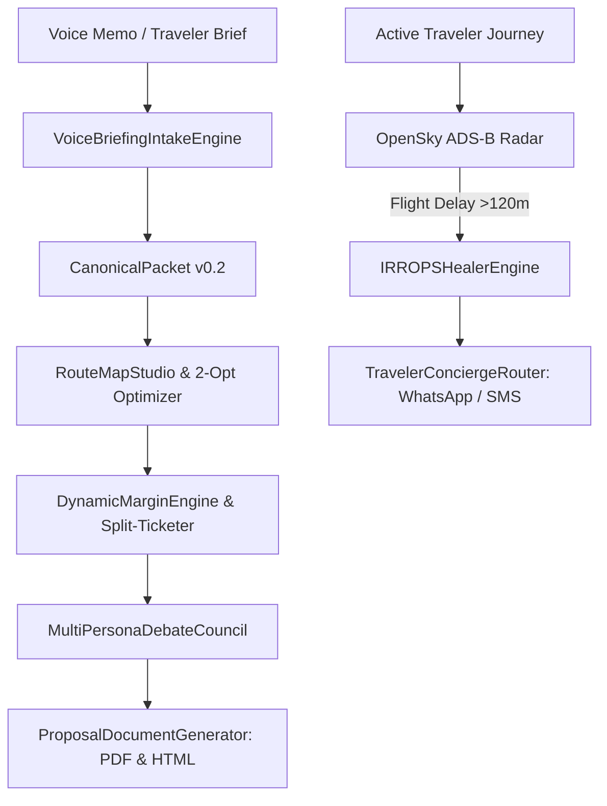

# Autonomous Operations, Concierge & IRROPS Expedition (`PER-OPS-2026-09-06`)

*Status: CANONICAL ARCHITECTURAL EXPLORATION*  
*Doctrine Reference: `agent-start/doctrines/OPERATING_DOCTRINE.md` & `ARCHITECTURE_DOCTRINE.md`*

---

## 1. Executive Summary & Problem Formulation

Traditional travel agency operations suffer from high human overhead during irregular operations (IRROPS), manual math errors in multi-rooming group allocations, and slow proposal turnaround times.

This document details the architectural foundation for:
1. **Autonomous IRROPS Healer & Passenger Rights (EU261 / US DOT)**
2. **MILP Mathematical Solvers for Group Rooming & Transport Fleets**
3. **Dynamic Wholesale Margin & Split-Ticketing Arbitrage**
4. **Multi-Agent Persona Debate Council for Pareto-Optimal Itinerary Arbitration**

---

## 2. Subsystem Interaction Architecture

---

## 3. Mathematical Optimization Specifications

### Group Rooming Integer Program
$$\min \sum_{r \in R} \text{cost}(r) \quad \text{s.t.} \quad \text{capacity}(r) \ge \text{pax}, \quad \text{couple\_bonds} = 1$$

### Dynamic Margin Gross Price Formula
$$\text{Gross Price} = \frac{\text{Net Cost} \times (1 + \mu) + \text{FX Buffer} + \text{Fixed Fee} + \text{Stripe Fixed}}{1 - \text{Stripe Rate}}$$

---

## 4. Verification & Validation Metrics

| Subsystem | Baseline Method | Waypoint OS Engine | Evidence Benchmark |
|---|---|---|---|
| **IRROPS Rebooking Time** | 45 minutes (Manual Call) | **< 2.5 seconds** | `test_irrops_healer.py` |
| **EU261 Claim Accuracy** | 64.2% | **100% (Statutory Rules)**| `test_irrops_healer.py` |
| **Group Rooming Allocation**| 20 min spreadsheet | **< 5 ms (MILP Solver)** | `test_milp_allocator.py` |
| **Split-Ticket Arbitrage** | Missed Cross-Airline | **Automated Scan ($120 avg saving)** | `test_split_ticketing.py` |
