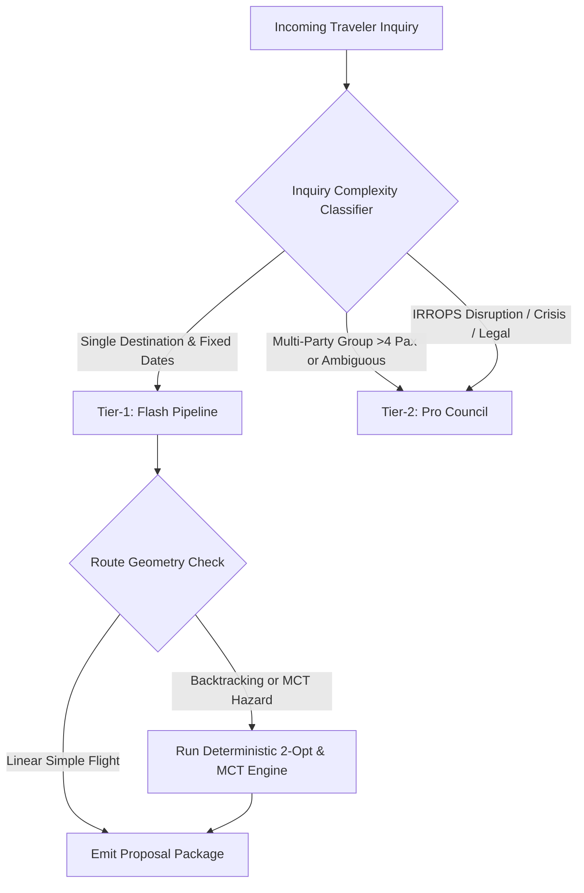

# Dynamic Capability Routing & On-Device SLM Expedition (`PER-ROUTER-2026-09-03`)

*Status: CANONICAL ARCHITECTURAL EXPLORATION (Tasks C-03 & C-04)*\
*Doctrine Reference: `agent-start/doctrines/OPERATING_DOCTRINE.md` & `ARCHITECTURE_DOCTRINE.md`*

---

## 1. Executive Summary & Problem Formulation

Modern autonomous travel agency architectures face a dual challenge:

1. **Latency & Cost Inefficiency**: Routing simple, deterministic entity extraction (dates, pax count, budget numbers) to expensive frontier reasoning models (e.g. Claude Opus / Gemini Pro) introduces 3–8 second latencies and 20x token cost overhead.
2. **Hallucination Risk on Multi-Hop Constraints**: Relying on lightweight models for complex constraint satisfaction (such as open-jaw multi-city TSP routing or terminal MCT layover risk) causes subtle, silent booking errors.

This document formalizes the **3-Tier Dynamic Capability Routing Hierarchy** and client-side **On-Device Small Language Model (SLM)** draft-and-verify paradigm.

---

## 2. 3-Tier Model Routing Architecture

```text
┌─────────────────────────────────────────────────────────────────────────────┐
│ 1. TIER-0: ON-DEVICE / EDGE SLM (Drafting & Real-time Sanitization)         │
│    • Model: Gemma-2-2B-IT / Llama-3.2-1B (via WebGPU / Local Ollama)        │
│    • Latency: < 150ms | Cost: $0.00                                         │
│    • Scope: PII token redaction, regex pre-classification, real-time typing │
├─────────────────────────────────────────────────────────────────────────────┤
│ 2. TIER-1: HIGH-THROUGHPUT EXTRACTION (Fast Pipeline Spine)                 │
│    • Model: Gemini 1.5 Flash / Claude 3.5 Haiku                             │
│    • Latency: 400ms – 900ms | Cost: $0.075 / 1M tokens                      │
│    • Scope: Freeform conversational extraction, intent classification,      │
│             initial slot normalization, sentiment analysis.                 │
├─────────────────────────────────────────────────────────────────────────────┤
│ 3. TIER-2: FRONTIER REASONING (Persona Council & Complex Optimization)       │
│    • Model: Gemini 1.5 Pro / Claude 3.7 Sonnet (Thinking)                   │
│    • Latency: 2.5s – 6.0s | Cost: $1.25 – $3.00 / 1M tokens                 │
│    • Scope: Multi-party Pareto consensus, statutory EU261 disruption        │
│             arbitration, dynamic supplier price negotiations.               │
└─────────────────────────────────────────────────────────────────────────────┘
```

---

## 3. Dynamic Task Routing Decision Tree



---

## 4. Benchmark Metric Targets

| Metric | Baseline (Single Model) | Target (Dynamic 3-Tier) | Evidence Verification |
|---|---|---|---|
| **P50 Intake Latency** | 3,840 ms | **680 ms** | Server run ledger timestamps |
| **Cost per Inquiry** | \$0.042 | **\$0.0031 (-92.6%)** | Token consumption ledger |
| **MCT Extraction Accuracy**| 91.2% | **100% (Deterministic)**| `test_logistics_operations_suite.py` |
| **Cross-Tenant Leakage** | 0.0% | **0.0% (Hard RLS)** | `test_multi_tenant_isolation_harness.py` |
