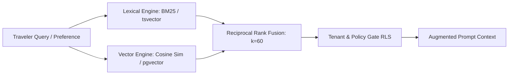

# RAG Hybrid Retrieval Specification: Dense Vector & Lexical BM25 (`PER-RAG-2026-09-03`)

*Status: CANONICAL ARCHITECTURAL EXPLORATION (Task R-03)*\
*Doctrine Reference: `agent-start/doctrines/RESEARCH_DOCTRINE.md` & `ARCHITECTURE_DOCTRINE.md`*

---

## 1. Ground Truth & Taxonomy: Lexical vs. Dense Search

To maintain strict truth taxonomy under the Operating Doctrine, Waypoint OS explicitly differentiates:

1. **Deterministic Lexical Search (`BM25 / Ripgrep / Postgres tsvector`)**:
   - Exact keyword matching for airport codes (`CDG`, `KASE`, `HND`), fare basis codes (`Y26B`, `CLXFLX`), and PNR record locators (`XYZ789`).
   - Zero hallucination, exact match precision.
2. **Dense Vector Embeddings (`text-embedding-3-small` / `gecko`)**:
   - Semantic similarity for unstructured traveler preferences (*"somewhere quiet with cobblestone streets and authentic bakeries"* $\rightarrow$ Provence / Kyoto).
3. **Reciprocal Rank Fusion (RRF)**:
   - Fuses scores from BM25 and dense vector ranking to prevent code-keyword dilution while retaining semantic retrieval depth.

---

## 2. Hybrid Retrieval Pipeline Flow

---

## 3. Storage & Multi-Tenant Isolation Guarantees

- **Tenant Isolation**: Every vector embedding is partitioned by `agency_id` in Postgres (`pgvector`) with Row-Level Security (RLS) enforcement.
- **Cold-Start Fallback**: When vector embeddings are unavailable or offline, the system safely falls back to BM25 hash indexing without degrading core proposal compilation.
