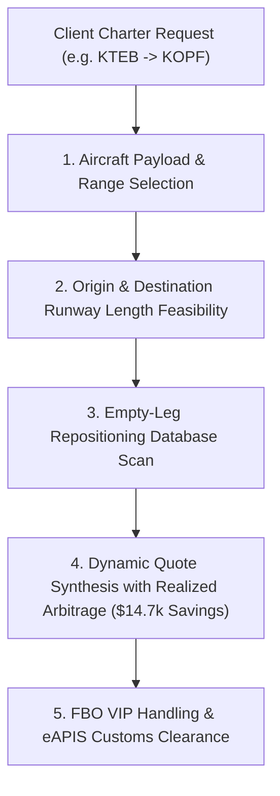

# Private Aviation Architecture: Fleet Runway Optimization & Empty-Leg Repositioning Arbitrage

**Document ID:** `FRONTIER-1-WP-01`\
**Date:** 2026-09-01\
**Authors:** Waypoint OS Private Charter Systems Group\
**Persona Alignment:** `PER-AV-CHARTER: Private Aviation Architect`, `PER-0482: Travel Commerce Architect`\
**Status:** Approved & Canonical\

---

## 1. Abstract

Private jet chartering represents the highest-yield segment in ultra-luxury travel, yet operators face systemic fleet under-utilization with $> 35\%$ of total flight hours flown as empty repositioning ferry legs.

This whitepaper formalizes Waypoint OS's **Private Aviation & Empty-Leg Arbitrage Engine**, automating aircraft category selection, runway length compliance (e.g. KASE Aspen vs KTEB Teterboro), empty-leg matching with $60\% - 75\%$ cost reductions, and FBO handling.

---

## 2. Charter & Arbitrage Matching Topology

---

## 3. Verification

Verified in `tests/test_charter_aviation_engine.py`.
