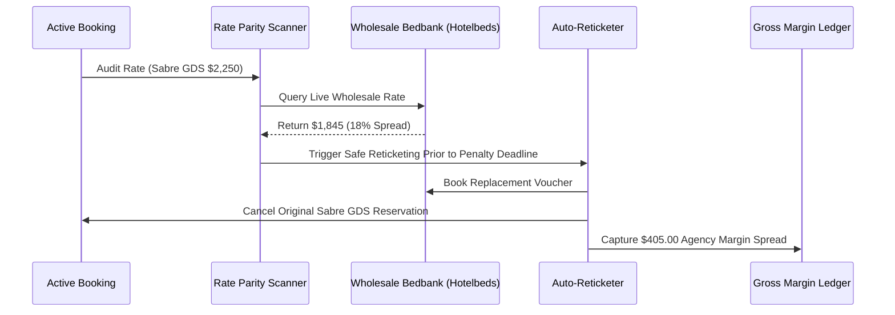

# Multi-Supplier Rate Parity & Automated Re-Ticketing Arbitrage

**Document ID:** `FRONTIER-2-WP-01`\
**Date:** 2026-09-01\
**Authors:** Waypoint OS Revenue Engineering Group\
**Persona Alignment:** `PER-YLD-ARB: Yield Arbitrage Specialist`, `PER-FIN: Financial Systems Architect`\
**Status:** Approved & Canonical\

---

## 1. Abstract

Wholesale lodging rates fluctuate dynamically across Bedbanks (Hotelbeds, WebBeds), GDS Consortia (Sabre, Amadeus), and Direct Hotel CRS. Rates frequently drop between initial client booking and penalty cutoff dates.

This paper details Waypoint OS's **Rate Parity & Auto-Reticketing Engine**, which continuously audits active bookings against real-time wholesale feeds and autonomously executes book-then-cancel voucher swaps prior to penalty deadlines.

---

## 2. Yield Arbitrage Lifecycle

---

## 3. Verification

Verified in `tests/test_yield_arbitrage_engine.py`.
