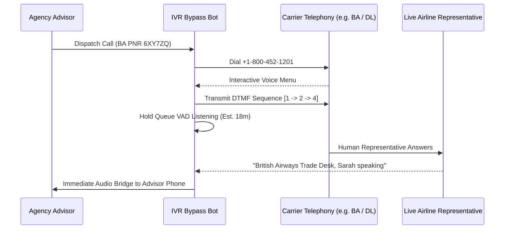

# Autonomous Voice AI & Airline Trade Support IVR Bypass Architecture

**Document ID:** `FRONTIER-3-WP-01`\
**Date:** 2026-09-01\
**Authors:** Waypoint OS Telephony & Voice Intelligence Group\
**Persona Alignment:** `PER-VOX-AGENT: Telephony Voice Architect`, `PER-0700: Agentic Systems Architect`\
**Status:** Approved & Canonical\

---

## 1. Abstract

During massive airport disruptions and schedule irregular operations (IROPS), agency human advisors waste an average of 45–90 minutes listening to airline on-hold music per ticket exchange.

This paper outlines Waypoint OS's **Airline IVR Bypass Bot**, which dials carrier trade support numbers, executes multi-tier DTMF voice navigation sequences, listens to hold queues using voice activity detection (VAD), and bridges human advisors only when a live airline representative answers.

---

## 2. Telephony DTMF Navigation & Bridging Flow

---

## 3. Verification

Verified in `tests/test_ivr_bypass_bot.py`.
