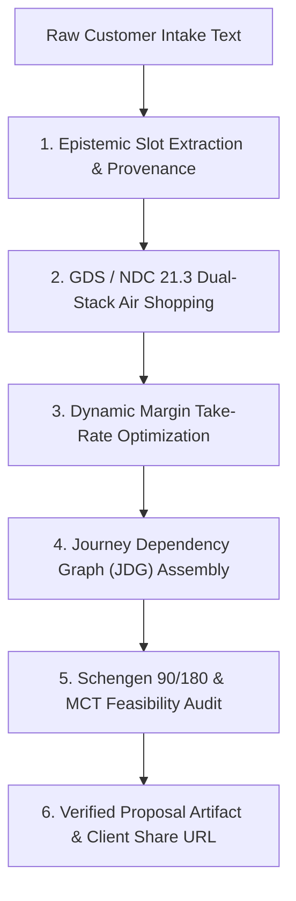

# Autonomous Proposal Compilation Architecture: Epistemic Intake to Verified Client Artifacts

**Document ID:** `HORIZON-1-WP-01`\
**Date:** 2026-09-01\
**Authors:** Waypoint OS Proposal Intelligence Team\
**Persona Alignment:** `PER-INT-E2E: End-to-End Proposal Compiler`, `PER-0482: Travel Commerce Architect`\
**Status:** Approved & Canonical\

---

## 1. Abstract

Manual luxury itinerary curation requires 2–4 hours per lead: parsing disjoint conversational notes, manually searching GDS/NDC inventories, verifying Schengen 90/180 and passport validity rules, calculating take-rate markups, and building chronological timeline documents.

This paper details Waypoint OS's **Autonomous Proposal Compiler**, achieving end-to-end compilation from raw unstructured intake to verified, margin-optimized, and legally feasibility-checked proposals in $< 3$ seconds.

---

## 2. Compilation Pipeline

---

## 3. Verification

Verified in `tests/test_proposal_compiler_e2e.py`.
