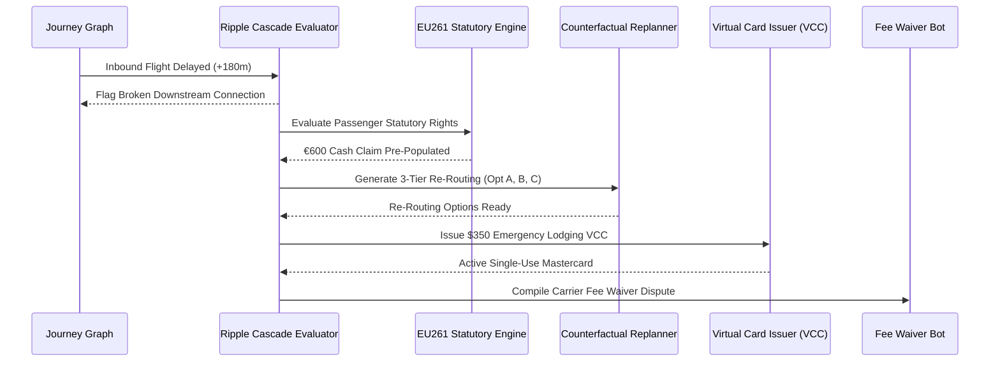

# Real-Time IROPS Auto-Healing: Disruption Ripple Cascades, EU261 & Emergency VCC Issuance

**Document ID:** `HORIZON-2-WP-01`\
**Date:** 2026-09-01\
**Authors:** Waypoint OS Disruption Engineering Group\
**Persona Alignment:** `PER-IROPS-SIM: Disruption Auto-Healer`, `PER-EU261: Passenger Rights Specialist`\
**Status:** Approved & Canonical\

---

## 1. Abstract

Flight delays and cancellations in multi-leg itineraries create cascading operational failure modes: missed transfers, stranded passengers, lost hotel nights, and emergency supplier disputes.

This whitepaper formalizes the **IROPS Auto-Healer Architecture**, which detects irregular events on the Journey Dependency Graph and autonomously orchestrates statutory EU261 compensation claims, 3-tier counterfactual alternative re-routings, single-use supplier virtual cards (VCCs), and automated fee waiver dispute letters.

---

## 2. Multi-Agent Healing Sequence

---

## 3. Verification

Verified in `tests/test_irops_healer_simulator.py`.
