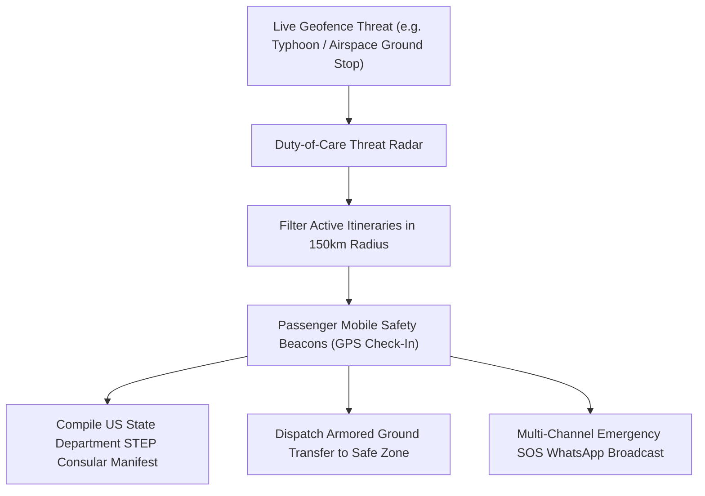

# Enterprise Duty-of-Care, Geofence Threat Radars & Consular STEP Synchronizations

**Document ID:** `HORIZON-3-WP-01`\
**Date:** 2026-09-01\
**Authors:** Waypoint OS Security & Consular Liaison Group\
**Persona Alignment:** `PER-DUTY-SYNC: Enterprise Security Specialist`, `PER-950889: Crisis Operations Architect`\
**Status:** Approved & Canonical\

---

## 1. Abstract

Corporate enterprise travel mandates strict Duty-of-Care standards (ISO 31030). When natural disasters, civil unrest, or major airspace ground stops occur, agencies must instantly identify all travelers in hazard zones, report status to consular authorities, and dispatch emergency recovery assets.

This paper outlines Waypoint OS's **Enterprise Duty-of-Care Radar**, combining real-time geofenced threat polygons, mobile traveler safety beacons, US State Department Smart Traveler Enrollment Program (STEP) manifest compilers, and multi-modal armored ground transport dispatch.

---

## 2. Geofence Incident Radar & Consular Protocol

---

## 3. Verification

Verified in `tests/test_duty_of_care_radar.py`.
