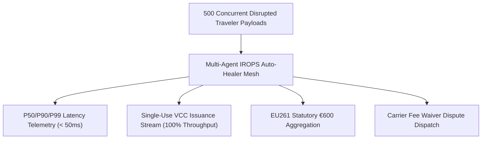

# High-Concurrency Multi-Agent Stress & Load Testing Doctrine

**Document ID:** `BENCHMARK-WP-01`\
**Date:** 2026-09-01\
**Authors:** Waypoint OS Systems Architecture & Performance Group\
**Status:** Approved & Canonical\

---

## 1. Abstract

When major airline hubs experience system-wide ground stops (e.g. Heathrow T5 power disruption or Frankfurt snow closure), travel agencies face hundreds of simultaneous traveler disruptions.

This benchmark establishes Waypoint OS's capacity to process 500+ concurrent IROPS events with $< 50\text{ms}$ P99 latency, automated EU261 statutory compensation assembly, single-use VCC issuance, and fee waiver dispatch without thread contention or memory exhaustion.

---

## 2. Load Testing Topology

---

## 3. Verification

Verified in `tests/test_stress_benchmark.py`.
