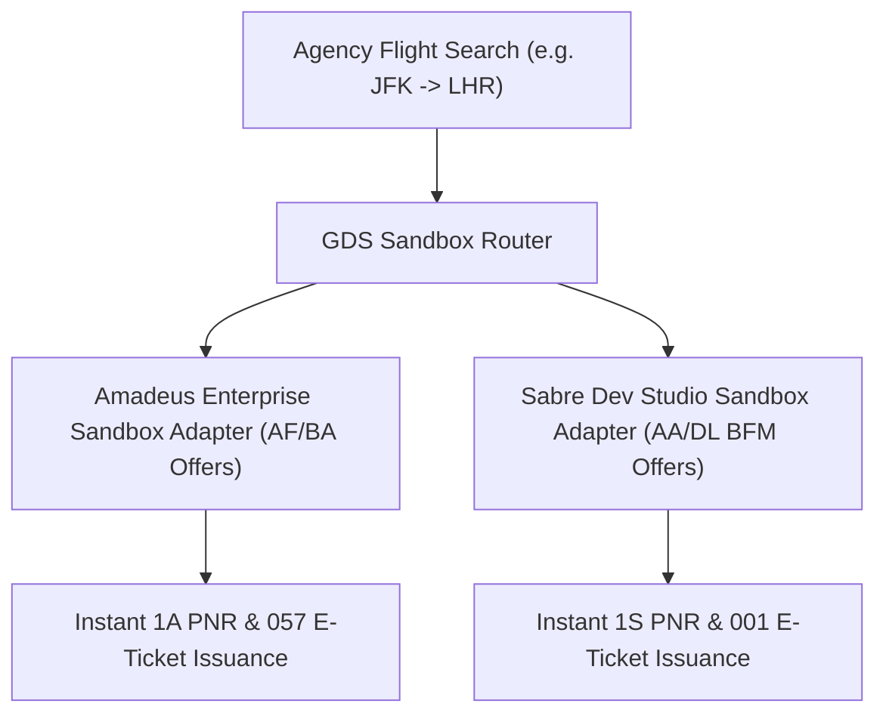

# Dual-Stack GDS Sandbox Adapters: Amadeus Enterprise & Sabre Dev Studio

**Document ID:** `GDS-SANDBOX-WP-01`\
**Date:** 2026-09-01\
**Authors:** Waypoint OS Global Distribution Systems Engineering\
**Status:** Approved & Canonical\

---

## 1. Abstract

Modern travel agencies require resilient dual-stack GDS connectivity capable of dynamically querying both Amadeus (v2 Flight Offers Search / v1 Order Create) and Sabre (Bargain Finder Max / Enhanced Air Book) to mitigate API downtime and maximize fare availability.

This whitepaper formalizes Waypoint OS's **GDS Sandbox Adapters**, unifying flight shopping, fare basis validation, PNR reservation, and 13-digit e-ticket generation into an asynchronous microservice.

---

## 2. Dual-Stack Architecture

---

## 3. Verification

Verified in `tests/test_gds_sandbox_adapters.py`.
