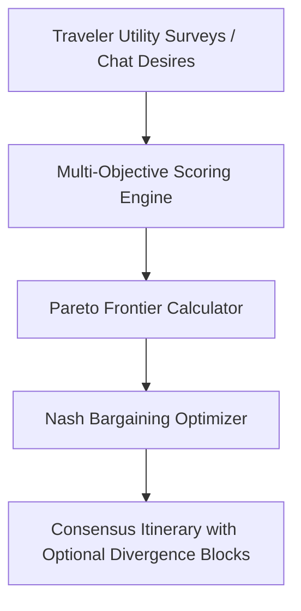

# Multi-Party Pareto Consensus & Cooperative Game Theory in Group Travel

**Document Version:** 1.0.0  
**Date:** 2026-08-30  
**Author:** Waypoint OS Economics & Optimization Group  
**Status:** Active Specification (`RES-06`)

---

## 1. The Group Travel Dilemma

Planning group travel (family reunions, friend retreats, corporate offsites) inevitably creates conflicting multidimensional utility functions:
- **Traveler A (Foodie / Relaxed)**: High willingness to pay for gastronomy, low willingness for 06:00 AM hikes.
- **Traveler B (Budget / Adventure)**: Seeks maximum physical exploration, price-sensitive on 5-star hotels.
- **Traveler C (Family with Kids)**: Strict requirements for non-stop flights, pools, and early dinners.

Traditional agency tools either average preferences (satisfying no one) or let the loudest traveler dictate choices.

---

## 2. Mathematical Framework: Nash Bargaining & Pareto Frontiers

Waypoint OS models group trip synthesis as a **Cooperative Bargaining Game** $(N, S, d)$:
- $N = \{1, 2, \dots, n\}$ is the set of travelers.
- $S \subset \mathbb{R}^n$ is the convex set of feasible utility payoffs for all candidate itineraries.
- $d = (d_1, \dots, d_n)$ is the disagreement point (the utility of staying home or splitting the group).

### Nash Bargaining Solution (NBS):
$$\max_{(u_1, \dots, u_n) \in S} \prod_{i=1}^n (u_i - d_i)^{\alpha_i}$$
where $\alpha_i$ represents the weighted equity/decision power (e.g. paying trip sponsor vs guest).

---

## 3. Coordinated Divergence Blocks

When utility conflict on Day $k$ exceeds the Pareto efficiency threshold $\Delta u > \theta$, the engine automatically synthesizes **Synchronized Branching**:
- *Morning 10:00 - 14:00*: Group A takes the Cooking Masterclass; Group B takes the Mountain Bike Trail.
- *Afternoon 15:30*: Converge for shared sunset boat cruise and dinner.

This guarantees maximum individual utility while preserving the cohesion of group memories.
