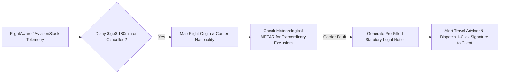

# Automated Passenger Rights & Regulatory Disruption Claims Architecture

**Document Version:** 1.0.0  
**Date:** 2026-08-30  
**Author:** Waypoint OS Regulatory & Air Telemetry Group  
**Status:** Active Specification (`RES-08`)

---

## 1. Statutory Air Passenger Rights Frameworks

Global aviation regulations mandate significant cash compensation for flight delays and cancellations under airline control:

| Jurisdiction | Primary Regulation | Delay Threshold | Compensation Range |
|---|---|---|---|
| **European Union** | **EC 261/2004** | $\ge 3$ hours at final destination | **€250 to €600** per passenger |
| **United Kingdom** | **UK261 / APR 2019** | $\ge 3$ hours at final destination | **£220 to £520** per passenger |
| **United States** | **US DOT 14 CFR 259/260** | Significant delay / Cancellation | Full cash refund + ancillary fee return |
| **India** | **DGCA CAR Sec 3 Ser M Pt IV** | Cancellation $<24$h / Block delay | **₹5,000 to ₹20,000** or rebooking + meals |

---

## 2. Automated Telemetry-Driven Claim Pipeline

Waypoint OS eliminates manual passenger claim friction by tracking flight radar telemetry autonomously:

### Claim Generator Rules:
1. **Distance-Based EU261 Calculation**:
   - Short Haul ($<1,500\text{ km}$): **€250**
   - Medium Haul ($1,500 - 3,500\text{ km}$): **€400**
   - Long Haul ($>3,500\text{ km}$): **€600**

2. **Carrier Defense Auditing**:
   - Compares airline claim of "weather disruption" against METAR / TAF weather records at departure/arrival airports to prevent bogus airline denials.
