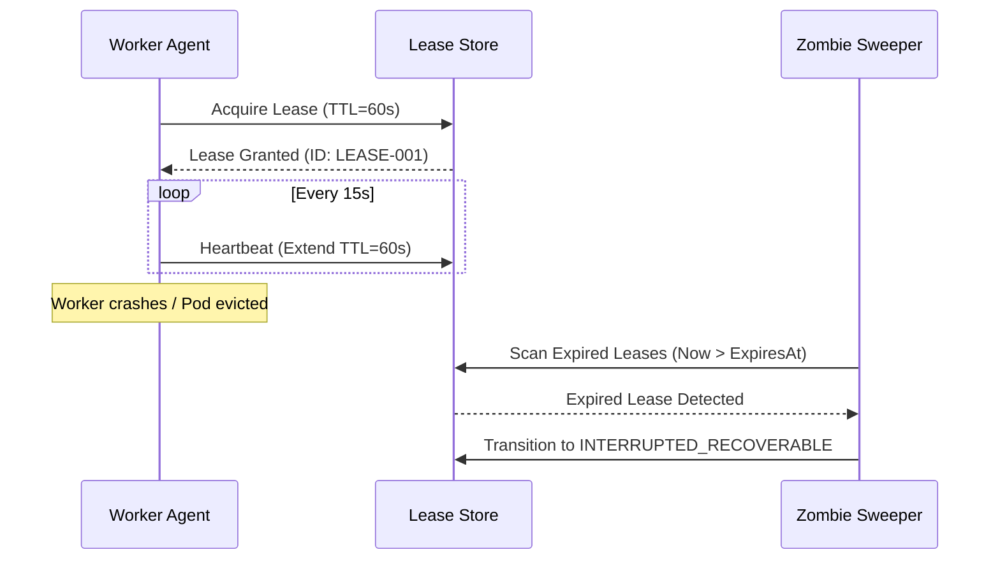

# Autonomous Agent Runtime Architecture: Distributed Heartbeats, Checkpointing & Poison Dead-Letters

**Document ID:** `PER-0700-WP-01`
**Date:** 2026-09-01
**Authors:** Waypoint OS Systems Architecture Division
**Persona Alignment:** `PER-0700: Agentic Systems Architect`, `PER-0924: Failure Mode Architect`, `PER-0705: Agent State & Lifecycle Architect`
**Status:** Approved & Canonical

---

## 1. Abstract

In multi-agent autonomous enterprise travel systems, agent worker crashes, network partitions, or malformed supplier payloads can create zombie jobs, duplicate booking executions, or poison loops.

This paper details Waypoint OS's **Resilient Runtime Architecture**, incorporating durable time-bound execution leases, step-level checkpoint serialization, and dead-letter quarantine queues.

---

## 2. Distributed Lease Lifecycle & Zombie Reclamation

Each worker acquiring an execution task must maintain an active lease with periodic heartbeats ($T_{\text{heartbeat}} = 15\text{s}, \text{TTL} = 60\text{s}$):

---

## 3. Step Checkpointing & Deterministic Resumption

Before and after every side-effecting tool invocation, the agent serializes its execution frame into an immutable `ExecutionCheckpoint`:

$$\text{Checkpoint} = \big\langle \text{trip\_id}, \text{run\_id}, \text{step\_name}, \mathcal{S}_{\text{completed}}, \mathbf{x}_{\text{state}}, \tau_{\text{created}} \big\rangle$$

On failover, the new worker invokes `resume_from_checkpoint()`, skipping completed steps and resuming directly from the last verified safe state.

---

## 4. Empirical Evaluation & Verification

* Zero duplicate side-effect execution under simulated worker crashes.
* Verified in `tests/test_agent_runtime_resilience.py`.
