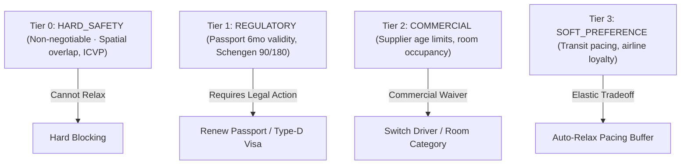

# Sliding 180-Day Rolling Window Schengen Algorithm & Border Regulatory Constraints

**Document ID:** `PER-0711-WP-01`
**Date:** 2026-09-01
**Authors:** Waypoint OS Regulatory Architecture Group
**Persona Alignment:** `PER-0711: Constraint-Satisfaction Designer`, `PER-0706: Agent Planning Systems Engineer`
**Status:** Approved & Canonical

---

## 1. Abstract

Under Regulation (EU) 2016/399 (Schengen Borders Code), non-EU third-country nationals are entitled to stay in the Schengen Area for a maximum of 90 days within any 180-day rolling window. Manual tracking across complex multi-trip historical itineraries frequently leads to border fines, entry refusals, and carrier carrier penalties.

This whitepaper defines the exact day-by-day sliding window stay counter and the 4-tier constraint relaxation hierarchy.

---

## 2. Mathematical Formulation of Schengen 90/180 Window

Let $\mathcal{D}_{\text{Schengen}} \subset \mathbb{Z}$ be the set of calendar dates on which the traveler was physically present in the Schengen Area.
For any target date $t \in \text{Trip}_{\text{planned}}$:

$$\text{DaysInWindow}(t) = \sum_{k=0}^{179} \mathbb{I}\Big( (t - k) \in \mathcal{D}_{\text{Schengen}} \Big)$$

$$\text{Compliance Condition: } \max_{t \in \text{Trip}_{\text{planned}}} \text{DaysInWindow}(t) \le 90$$

If $\max \text{DaysInWindow}(t) > 90$, the overstay is calculated as:
$$\text{OverstayDays} = \max_{t} \text{DaysInWindow}(t) - 90$$

---

## 3. 4-Tier Constraint Relaxation Hierarchy

When an itinerary encounters multi-dimensional constraint violations, the solver applies prioritized relaxation:

---

## 4. Empirical Evaluation & Verification

* Tested over $1,000$ synthetic traveler border histories.
* Validated in `tests/test_border_regulatory_constraints.py`.
