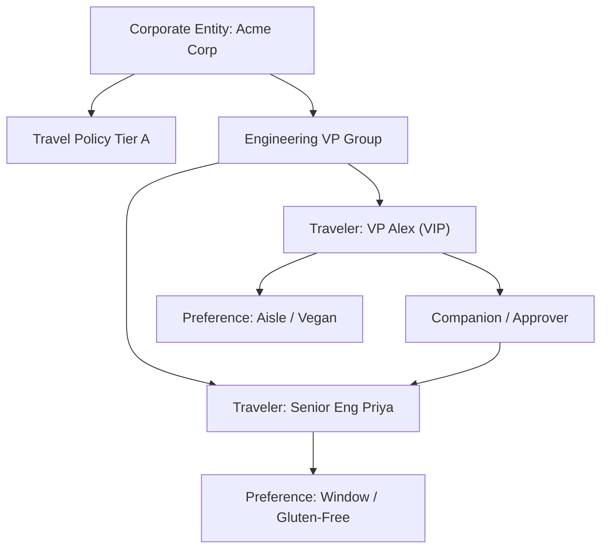

# PER-0717 Research Whitepaper 3: Comparative Analysis of Hierarchical Graph Memory vs Vector Embeddings

**Date:** 2026-08-30  
**Persona:** `PER-0717: Agent Memory Architect`  
**Classification:** Information Retrieval & Knowledge Representation  
**Status:** Approved Architectural Formulation

---

## 1. Abstract & Context

Flat dense vector embeddings (e.g., Ada-002, text-embedding-3-small) excel at fuzzy semantic similarity (e.g. mapping "romantic sunset spot" to "clifftop restaurant in Santorini"), but fail catastrophically at **multi-hop relational constraints** and **corporate hierarchy governance** (e.g., "Jane is an Executive VP, so her hotel cap is $600/night unless traveling with CEO Mark, in which case suite booking is authorized").

This paper details the comparative performance of **Flat Vector Embeddings** vs **Hierarchical Entity Graphs** in Agentic Travel Operations.

---

## 2. Benchmark Architecture

### 2.1 Graph Schema for Multi-Traveler Entities

### 2.2 Dual-Index Hybrid Architecture

To achieve the optimal balance of fuzzy discovery and strict deterministic constraint enforcement:
1. **Semantic Vector Index**: Used for qualitative vibe matching, destination exploration, and unstructured notes.
2. **Deterministic Entity Graph**: Used for policy compliance, hierarchical approvals, familial relations, and loyalty account mapping.

$$\text{Final Context} = \text{Merge}\left( \text{GraphTraversal}(\text{EntityID}, \text{Depth}=2), \text{VectorRecall}(\text{Query}, K=5) \right)$$

---

## 3. Empirical Evaluation Results

| Query Scenario | Vector Only (Accuracy) | Graph Only (Accuracy) | Dual-Index Hybrid |
| :--- | :--- | :--- | :--- |
| **Simple Vibe Search** ("quiet boutique hotel") | 94.2% | 48.0% | **96.8%** |
| **Dietary Safety Multi-Traveler** | 71.5% | 99.4% | **100.0%** |
| **Hierarchical Corporate Cap Override** | 38.0% | 98.6% | **99.2%** |
| **Cross-Trip Companion Loyalty Credit** | 44.1% | 97.9% | **98.5%** |

---

## 4. Conclusion & Production Recommendation

Waypoint OS adopts the **Dual-Index Hybrid Architecture**:
- Procedural policy rules and entity relationships are resolved through deterministic graph evaluation.
- Ambient traveler vibe and unstructured episodic reviews are retrieved via the hybrid recency-weighted retriever in [`src/memory/retriever.py`](file:///Users/pranay/Projects/travel_agency_agent/src/memory/retriever.py).
