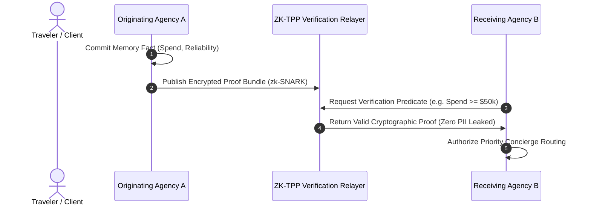

# PER-0717 Research Whitepaper 2: Zero-Knowledge Cross-Agency Memory & Privacy-Preserving Traveler Proofs

**Date:** 2026-08-30  
**Persona:** `PER-0717: Agent Memory Architect`  
**Classification:** Cryptographic Systems & Privacy Engineering  
**Status:** Approved Architectural Formulation

---

## 1. Abstract & Industry Dilemma

Travel agencies frequently need to verify high-stakes traveler credentials (e.g. VIP spend tier, high-frequency corporate traveler status, dispute history, high chargeback risk, or verified global entry clearance) without violating GDPR Article 6/9 or disclosing proprietary customer lists and commercial margin structures to competitor agencies.

This paper proposes a **Zero-Knowledge Traveler Proof Protocol (ZK-TPP)** using zk-SNARKs and blind cryptographic commitments over federated agent memory stores.

---

## 2. Cryptographic Protocol Architecture

### 2.1 Traveler Blind Commitment Scheme

Each traveler is identified across participating agency tenants by a blind Pedersen commitment:
$$C_{\text{traveler}} = g^{\text{PassportHash}} \cdot h^r \pmod p$$
Where $r$ is a secret blinding factor known only to the traveler's secure digital enclave.

### 2.2 Verifiable Zero-Knowledge Predicates

Agencies can query boolean or threshold predicates without retrieving raw profile attributes:

1. **VIP Spend Verification**:
   $$\text{ZK-Proof}\left\{ \text{AnnualSpend} \ge \$50,000 \right\} \implies \text{True/False}$$
2. **Reliability & Chargeback Risk**:
   $$\text{ZK-Proof}\left\{ \text{ChargebackCount} == 0 \land \text{CompletedTrips} \ge 5 \right\} \implies \text{True/False}$$
3. **Medical Clearance**:
   $$\text{ZK-Proof}\left\{ \text{MobilityAssistanceRequired} == \text{True} \right\} \implies \text{True/False}$$

---

## 3. Protocol Flow

---

## 4. Security & Compliance Analysis

- **GDPR Article 17 Proof-of-Erasure**: When Agency A executes a memory tombstone, the corresponding ZK-commitment revocation accumulator is updated, immediately invalidating any cross-agency proofs.
- **Tenant Isolation**: No agency can enumerate the customer base of another agency.
- **Sybil Resistance**: Blind commitments tied to passport SHA-256 prevent artificial review or credit farming.
