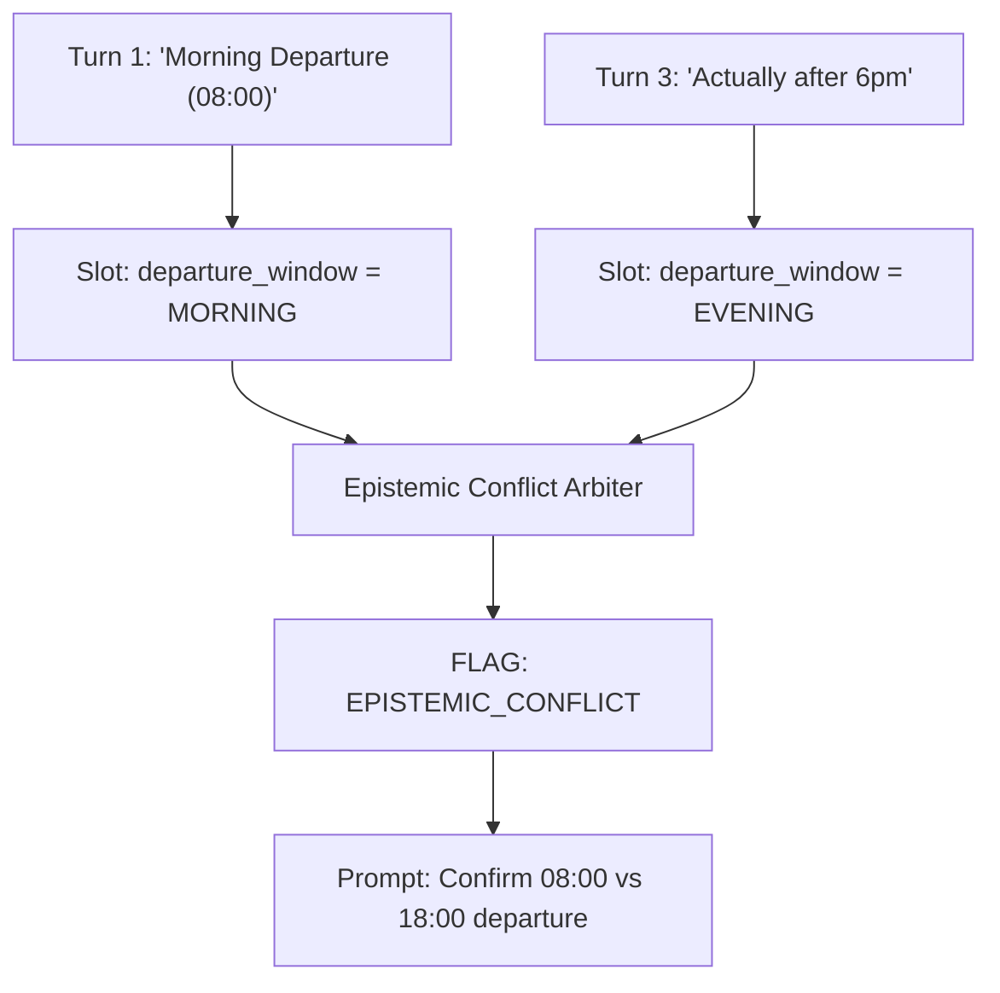

# Epistemic Provenance, Conflict Arbitration & JSON-LD Proof Graphs

**Document ID:** `PER-0922-WP-01`\
**Date:** 2026-09-01\
**Authors:** Waypoint OS Epistemic Integrity Division\
**Persona Alignment:** `PER-0922: Epistemic Integrity Architect`, `PER-0923: Evidence Architect`\
**Status:** Approved & Canonical\

---

## 1. Abstract

AI-driven travel intake systems are notoriously prone to "assumption drift"—where unverified inferences, conversational contradictions, or outdated preferences are silently promoted to hard booking facts.

This paper establishes Waypoint OS's **Epistemic Provenance Framework**, guaranteeing field-level confidence tracking, SHA-256 cryptographic provenance hashing, automated multi-turn conflict detection, and machine-readable W3C JSON-LD proof graphs.

---

## 2. Multi-Turn Conflict Arbitration Protocol

Let a conversation consist of turns $T = \{t_1, t_2, \dots, t_N\}$. Each extracted attribute $x \in \mathcal{X}$ is stored as an immutable assertion:

$$a_i = \big\langle \text{slot}(x), \text{val}(x), t_i, \text{conf}(x), \text{hash}(x) \big\rangle$$

A conversational contradiction exists when:

$$\exists a_i, a_j \text{ such that } \text{slot}(a_i) = \text{slot}(a_j) \land \text{val}(a_i) \neq \text{val}(a_j) \land t_i \neq t_j$$

Upon detecting a contradiction, the engine suspends automated quoting, sets `epistemic_status = CONFLICTED`, and generates a deterministic clarification prompt.

---

## 3. Machine-Readable JSON-LD Proof Graph

All verified attributes are compiled into an interoperable JSON-LD knowledge graph grounding downstream booking tasks with exact transcript quotes.

---

## 4. Verification

Verified in `tests/test_epistemic_provenance_arbiter.py`.
