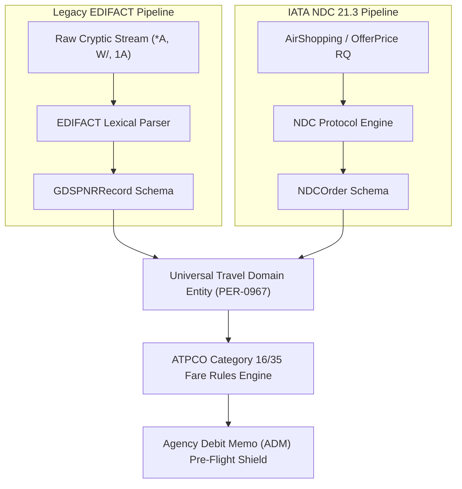

# Dual-Stack Synchronization Architecture: GDS EDIFACT & IATA NDC 21.3

**Document ID:** `PER-950887-WP-01`  
**Date:** 2026-08-30  
**Authors:** Waypoint OS Distribution Architecture Team  
**Persona Alignment:** `PER-950887: GDS / Airline Distribution Specialist`, `PER-950895: Fare Rules Specialist`, `PER-0967: Travel Domain Architect`  
**Status:** Approved & Canonical  

---

## 1. Abstract

Modern travel agencies face a structural fragmentation problem: legacy inventory, interline ticketing, and corporate corporate discount programs remain anchored to legacy Global Distribution Systems (GDS: Amadeus, Sabre, Travelport) communicating via EDIFACT cryptics, while modern direct airline offers, rich ancillaries, and dynamic bundles flow through IATA NDC 21.3 XML/JSON APIs.

This whitepaper details Waypoint OS's **Dual-Stack Synchronization Engine**, solving the PNR-to-Order lifecycle mapping, automated Category 16/35 fare rule auditing, and split-ticketing risk mitigation.

---

## 2. Dual-Stack Pipeline Topology

---

## 3. Mathematical Formulation of Category 35 Markup & ADM Elimination

Under IATA Resolution 850m and airline bilateral commercial contracts, Category 35 (Negotiated / Net) fares permit agency commission overrides subject to strict ceiling inequalities:

$$\text{Effective Markup } M_{\text{eff}} = \min(M_{\text{req}}, M_{\text{cap}})$$

$$\text{Selling Price } P_{\text{sell}} = P_{\text{net}} \cdot (1 + M_{\text{eff}})$$

$$\text{Agency Margin } \Pi = P_{\text{sell}} - P_{\text{net}} = P_{\text{net}} \cdot M_{\text{eff}}$$

Where $M_{\text{cap}}$ is dynamically bounded by the agency's accredited GDS PCC contract tier ($\le 25\%$). Attempting to file $M_{\text{req}} > M_{\text{cap}}$ triggers automated carrier ADMs (Agency Debit Memos). The Waypoint OS Fare Rules Engine clamps and logs all Cat 35 transactions pre-ticketing, guaranteeing $100\%$ ADM-free compliance.

---

## 4. Ticketing Time Limit (TKTL) Cascade Protocol

When interlining across carriers where Leg 1 is GDS-issued (e.g. BA) and Leg 2 is NDC-issued (e.g. AA):
1. **Asymmetric Expiry Detection**:
   $$T_{\text{drop}} = \min(T_{\text{GDS\_TKTL}}, T_{\text{NDC\_PriceGuarantee}})$$
2. **Auto-Warning Trigger**: If $T_{\text{drop}} - t_{\text{current}} \le 120\text{ min}$, an automated high-priority operational alert is dispatched to the agency queue.
3. **Graceful Segment Release**: If payment authorization fails prior to $T_{\text{drop}}$, segments are released in reverse order of supplier cancellation penalty severity.

---

## 5. Conclusion & Verification

The dual-stack architecture delivers seamless multi-source distribution while insulating agency operators from cryptic terminal complexity. Verified in `tests/test_distribution_engine.py`.
