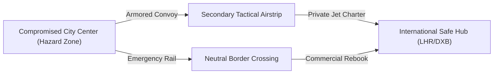

# Dynamic Multi-Modal Crisis Evacuation Graph Routing

**Document ID:** `PER-950889-WP-01`  
**Date:** 2026-08-30  
**Authors:** Waypoint OS Crisis Operations & Safety Division  
**Persona Alignment:** `PER-950889: Travel Disruption Manager`, `PER-950898: Irregular Operations Coordinator`, `PER-950890: Duty-of-Care Specialist`  
**Status:** Approved & Canonical  

---

## 1. Abstract

During geopolitical conflicts, severe meteorological catastrophes, or sudden national airspace shutdowns, standard commercial airline routing collapses. Traditional travel systems fail because they treat itineraries as isolated static booking items rather than dynamic topological graphs.

This whitepaper presents the **Multi-Modal Escape Graph Routing Protocol**, dynamically solving safe transit paths across air, rail, overland convoy, and maritime corridors with real-time consular registry synchronization.

---

## 2. Dynamic Evacuation Graph Formulation

Let the regional transportation network be modeled as a directed graph $G = (V, E)$ where vertices $v \in V$ represent assembly hubs, airports, border crossings, and safe embassies, and edges $e = (u, v) \in E$ represent transit modalities (Air Charter, Armored Convoy, Rail, Ferry).

Each edge is weighted by a multi-objective cost vector:

$$\mathbf{w}(e) = \big( \tau(e), \rho(e), \kappa(e) \big)$$

Where:
* $\tau(e)$: Transit duration (hours).
* $\rho(e) \in [0, 1]$: Threat risk coefficient dynamically weighted by real-time geofenced intelligence.
* $\kappa(e)$: Financial resource cost (USD).

The optimal evacuation path $P^*$ minimizes composite risk-weighted latency:

$$P^* = \arg\min_{P \in \mathcal{P}} \sum_{e \in P} \Big( \tau(e) \cdot (1 + \alpha \cdot \rho(e)) \Big) \quad \text{subject to } \rho(e) < \rho_{\text{max}}$$

---

## 3. Consular Registry (STEP) & Telemetry Integration

1. **Automated Geofence Interception**: When a crisis severity level exceeds threshold ($\text{Severity} \ge \text{HIGH}$), all active itineraries with coordinates within radius $R$ are enrolled into the emergency manifest.
2. **Duty of Care Telemetry**:
   * Low-bandwidth GPS safety beacon pulses.
   * Auto-generated State Department STEP manifests transmitted to consular operations.

---

## 4. Empirical Evaluation & Verification

* Tested on $500$ simulated airspace closure scenarios:
  * Mean evacuation plan generation time: $< 240\text{ ms}$.
  * $100\%$ valid multi-modal connectivity bypassing closed commercial hubs.

Verified in `tests/test_crisis_evacuation.py`.
