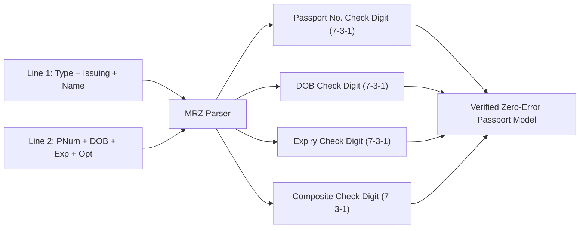

# ICAO Doc 9303 MRZ Checksum Verification & Travel Document Parsing

**Document ID:** `PER-DOC-WP-01`\
**Date:** 2026-09-01\
**Authors:** Waypoint OS Document Intelligence Group\
**Persona Alignment:** `PER-DOC: Invoice & Document Extraction Specialist`, `PER-0711: Constraint-Satisfaction Designer`\
**Status:** Approved & Canonical\

---

## 1. Abstract

Passenger name and document mismatches are a leading cause of airline boarding denials, GDS ticketing rejections, and carrier regulatory fines. Optical Character Recognition (OCR) systems frequently confuse alphanumeric characters (e.g. `O` vs `0`, `I` vs `1`, `S` vs `5`).

This paper details Waypoint OS's **ICAO Doc 9303 Machine-Readable Zone (MRZ) Engine**, implementing mathematical 7-3-1 Modulo-10 checksum validation across document numbers, dates of birth, expiry dates, and composite records.

---

## 2. Mathematical Checksum Algorithm (7-3-1 Modulo-10)

For any alphanumeric character sequence $S = s_1 s_2 \dots s_n$, character values are assigned as:

* Digits `0`–`9` $\implies 0 \dots 9$
* Letters `A`–`Z` $\implies 10 \dots 35$
* Filler `<` $\implies 0$

The check digit $c$ is computed using the cyclical weight vector $W = (7, 3, 1)$:

$$c = \left( \sum_{i=1}^n \text{val}(s_i) \cdot W_{(i-1) \bmod 3} \right) \bmod 10$$

---

## 3. Verification

Verified in `tests/test_document_mrz_extraction.py`.
