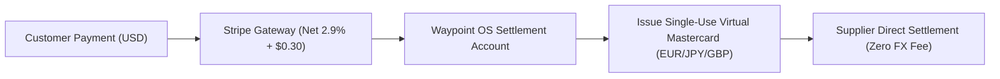

# Travel Financial Settlement: FX Volatility Buffers, Gateway Deduction & Supplier Virtual Cards

**Document ID:** `PER-FIN-WP-01`\
**Date:** 2026-09-01\
**Authors:** Waypoint OS Financial Engineering Division\
**Persona Alignment:** `PER-FIN: Travel Financial Systems Architect`, `PER-0482: Travel Commerce Architect`\
**Status:** Approved & Canonical\

---

## 1. Abstract

Cross-border travel transactions carry substantial currency volatility risk between the moment an itinerary is quoted and when supplier bookings are settled. Furthermore, paying suppliers in non-native currencies triggers 3.0% bank conversion fees and fraud holds.

This paper details Waypoint OS's **Financial Settlement Architecture**, featuring dynamic FX volatility buffers, payment gateway fee netting, single-use supplier virtual cards (VCCs), and multi-tier commission ledger splits.

---

## 2. Dynamic FX Volatility Buffer & Gateway Deduction

Let $A_{\text{base}}$ be the net inventory cost in supplier currency $C_s$, and $R_{\text{raw}}$ be the spot exchange rate to customer currency $C_c$. The buffered customer quote $Q$ is computed with volatility margin $\beta_{\text{FX}} \in [0.015, 0.030]$:

$$R_{\text{buffered}} = R_{\text{raw}} \cdot (1 + \beta_{\text{FX}})$$

$$Q = \text{round}\big( A_{\text{base}} \cdot R_{\text{buffered}}, 2 \big)$$

The net settled revenue after payment processor deduction ($\alpha_{\text{interchange}} = 0.029, \delta_{\text{fixed}} = \$0.30$) is:

$$\text{Fee}_{\text{gateway}} = Q \cdot \alpha_{\text{interchange}} + \delta_{\text{fixed}}$$

$$\text{NetSettled} = Q - \text{Fee}_{\text{gateway}}$$

---

## 3. Verification

Verified in `tests/test_financial_settlement_vcc.py`.
