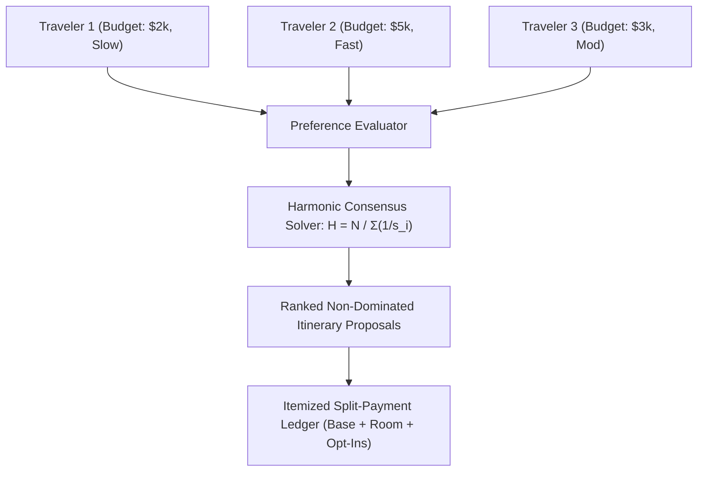

# Multi-Traveler Pareto Consensus, Harmonic Penalties & Itemized Split Ledgers

**Document ID:** `PER-GRP-WP-01`\
**Date:** 2026-09-01\
**Authors:** Waypoint OS Social Dynamics & Collective Choice Group\
**Persona Alignment:** `PER-GRP: Family & Group Travel Architect`, `PER-0482: Travel Commerce Architect`\
**Status:** Approved & Canonical\

---

## 1. Abstract

Planning group travel is notoriously dysfunctional due to asymmetric budgets, divergent activity preferences, and split-payment friction. Standard arithmetic average satisfaction metrics hide tyranny of the majority—where a single miserable traveler ruins the group dynamic.

This paper establishes Waypoint OS's **Pareto Consensus & Split Ledger Framework**, employing harmonic mean satisfaction penalties and itemized per-traveler payment ledgers.

---

## 2. Harmonic Mean Consensus Formulation

Let $N$ travelers have satisfaction scores $s_i \in (0, 1]$ for an itinerary proposal $P$. The aggregate group consensus score $H(P)$ is defined as the harmonic mean:

$$H(P) = \frac{N}{\sum_{i=1}^N \frac{1}{s_i}}$$

Unlike the arithmetic mean $\frac{1}{N}\sum s_i$, the harmonic mean severely penalizes high variance and single-traveler dissatisfaction:

$$\lim_{s_i \to 0} H(P) = 0$$

---

## 3. Verification

Verified in `tests/test_group_pareto_consensus.py`.
