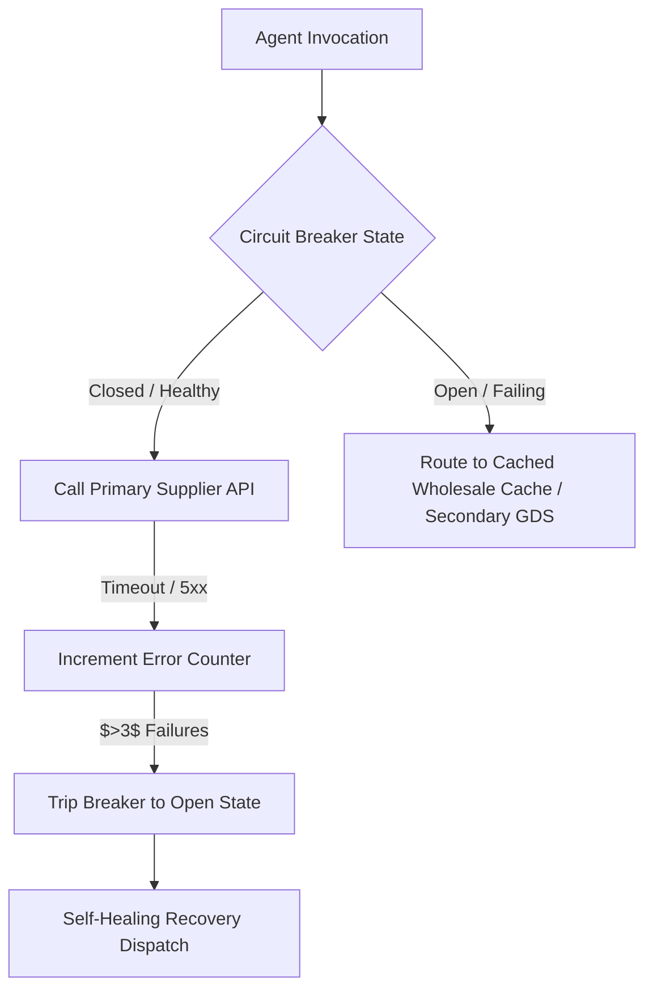

# Synthetic Chaos SRE & Self-Healing Agent Mesh Architecture

**Document Version:** 1.0.0  
**Date:** 2026-08-30  
**Author:** Waypoint OS SRE & Reliability Engineering  
**Status:** Active Specification (`RES-09`)

---

## 1. Failure Modes in Autonomous Multi-Agent Agency Systems

In high-concurrency travel operations, downstream suppliers (Amadeus, Sabre, Hotelbeds, Stripe, Email/SMS webhooks) degrade unpredictably. Synthetic chaos testing evaluates the resilience of agent swarms under adverse operational conditions:

1. **Slow Supplier Degradation**: GDS API response times degrade from 400ms to 12,000ms.
2. **Partitioned Subagents**: A subagent specializing in hotel sourcing crashes mid-pipeline during group proposal generation.
3. **Corrupted Inventory Schemas**: Bedbank returns non-standard JSON payloads or missing price objects.

---

## 2. Chaos Injection Scenarios & Self-Healing Circuit Breakers

### Key SRE Guarantees:
- **Zero Silent Failures**: All supplier exceptions are caught by typed fallbacks and surfaced with degraded trust indicators.
- **Fail-Closed Financial Boundaries**: If payment or pricing validation fails mid-execution, the transaction immediately rolls back without charging traveler cards or committing non-refundable inventory.
