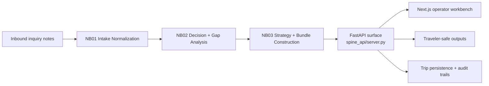

# Waypoint OS (travel_agency_agent)

Waypoint OS is an operations and revenue co-pilot for boutique travel agencies.

It ingests messy inbound travel notes, structures them into canonical trip packets, runs decision logic, and produces both operator-facing and traveler-safe outputs.

---

## Start here (by role)

- **Operator / product reviewer**
  - `Quick start`
  - `API sanity checks`
  - `Common failure modes`
- **Backend engineer**
  - `Architecture at a glance`
  - `API surface`
  - `Pre-PR verification checklist`
- **Frontend engineer**
  - `Developer workflows`
  - `First 30 minutes in this repo`
  - `Pre-PR verification checklist`
- **Coding agent**
  - `For coding agents (important)`
  - `First 30 minutes in this repo`
  - `Contract-change rules`

---

## Quick start (real, working commands)

### Prerequisites

- Python `>=3.13`
- [uv](https://docs.astral.sh/uv/) for Python dependency management
- Node.js + npm for the frontend

### 1) Install dependencies

```bash
uv sync
cd frontend && npm install
```

### 2) Start local stack

Use the repo helper (starts backend + frontend):

```bash
./dev.sh
```

Endpoints:

- Backend API: `http://127.0.0.1:8000`
- Backend health: `http://127.0.0.1:8000/health`
- Frontend: `http://localhost:3000`

### 3) Run tests

```bash
uv run pytest
cd frontend && npm run test
```

### 4) One-command verification

```bash
./scripts/verify.sh
```

---

## What this repo is for

- **Agency intake normalization**: convert vague/contradictory inquiry text into structured packets
- **Decision support**: classify blockers, confidence, and next-action state
- **Strategy generation**: create internal operator guidance + traveler-safe messaging
- **Operator workbench**: web UI for inbox, trip lifecycle, governance, settings, analytics, and review flows

Core design principle: keep raw/internal decision context separate from traveler-facing output.

---

## Architecture at a glance

### Pipeline flow

```text
Inquiry → NB01 Intake → NB02 Decision/Gaps → NB03 Strategy/Bundles → API/UI surfaces
```

### System diagram



### Dual-output safety boundary

- **Internal bundle**: includes richer context (decision state, confidence, strategy scaffolding)
- **Traveler bundle**: excludes internal-only artifacts by design
- **Leakage guard**: strict mode can block traveler output when unsafe terms are detected

### Runtime surfaces

- FastAPI app in `spine_api/server.py`
- Next.js 16 frontend in `frontend/`
- Legacy/prototype Streamlit app in `app.py` (not the main operator UI)

---

## Repository map (practical)

```text
spine_api/                      # FastAPI service, routers, contracts, persistence adapters
src/intake/                     # Intake + decision + strategy pipeline implementation
src/suitability/                # Suitability scoring and integration logic
frontend/                       # Next.js operator workbench (React 19, TS)
tests/                          # Python test suite
frontend/src/**/__tests__/      # Frontend tests (Vitest)
data/                           # Runtime and fixture data (see data notes below)
alembic/                        # DB migrations
Docs/                           # Specs, audits, status docs, implementation notes
tools/                          # Reusable utilities and scripts
```

---

## Configuration notes that matter

### TripStore backend

This codebase supports multiple trip persistence backends, selected via env.

- `TRIPSTORE_BACKEND=sql` → PostgreSQL-backed trip persistence
- Missing/other values can route to file-backed behavior in non-production contexts

For consistent local behavior with agency data, keep `.env` aligned with SQL usage when expected.

### Useful env vars (backend)

- `SPINE_API_HOST` (default `127.0.0.1`)
- `SPINE_API_PORT` (default `8000`)
- `SPINE_API_CORS` (defaults include `localhost:3000`)
- `TRAVELER_SAFE_STRICT` (`1/true/yes` to enforce strict leakage blocking)

---

## Developer workflows

### Backend only

```bash
uv run uvicorn spine_api.server:app --port 8000 --reload
```

### Frontend only

```bash
cd frontend && npm run dev
```

### Lint and typecheck (frontend)

```bash
cd frontend && npm run lint && npm run typecheck
```

### Coverage (frontend)

```bash
cd frontend && npm run test:coverage
```

---

## API surface (quick external map)

The backend currently exposes a broad surface area (snapshot: `131` OpenAPI paths in `tests/fixtures/server_openapi_paths_snapshot.json`).

Use this as a practical orientation map:

| Domain | Representative endpoints |
| --- | --- |
| Health + run pipeline | `GET /health`, `POST /run`, `GET /runs/{run_id}` |
| Auth + identity | `POST /api/auth/login`, `POST /api/auth/signup`, `GET /api/auth/me` |
| Trips + lifecycle | `GET /trips`, `GET /trips/{trip_id}`, `POST /trips/{trip_id}/stage` |
| Assignments | `GET /api/assignments/{trip_id}`, `POST /api/assignments/{trip_id}/assign` |
| Settings + governance | `GET /api/settings`, `PUT /api/settings/pipeline`, `PUT /api/settings/autonomy` |
| Analytics | `GET /analytics/summary`, `GET /analytics/pipeline`, `GET /analytics/revenue` |
| Inbox + followups | `GET /inbox`, `GET /inbox/stats`, `POST /followups/{trip_id}/snooze` |
| Integrations + public flows | `GET /api/integrations`, `POST /api/public-checker/run`, `POST /api/public/booking-collection/{agency_id}/{token}/submit` |

### Auth expectations

- Protected routes accept JWT auth via:
  - `Authorization: Bearer <token>` header, or
  - `access_token` cookie fallback
- In local dev/test, auth can be bypassed when `SPINE_API_DISABLE_AUTH` is set (do **not** use this in production-like environments).

### API discovery

- Interactive docs: `http://127.0.0.1:8000/docs`
- Route snapshots used in tests:
  - `tests/fixtures/server_openapi_paths_snapshot.json`
  - `tests/fixtures/server_route_snapshot.json`

---

## First 30 minutes in this repo

If you are new (human or agent), this sequence gets you productive quickly.

### Minute 0-5: boot and verify

```bash
uv sync
cd frontend && npm install && cd ..
./dev.sh
```

In another terminal:

```bash
curl -s http://127.0.0.1:8000/health
```

Expected: healthy JSON response and frontend reachable at `http://localhost:3000`.

### Minute 5-15: run one backend + one frontend test slice

```bash
uv run pytest tests/test_inbox_router_contract.py -q
cd frontend && npm run test -- src/app/(agency)/overview/__tests__/page.test.tsx
```

This confirms both stacks are wired before deep edits.

### Minute 15-25: learn the main control points

- Backend entry and router composition: `spine_api/server.py`
- Pipeline orchestration: `src/intake/orchestration.py`
- Contract models: `spine_api/contract.py`
- Frontend route map/API client:
  - `frontend/src/lib/route-map.ts`
  - `frontend/src/lib/api-client.ts`

### Minute 25-30: read project operating constraints

Read these before proposing architecture or route changes:

1. `AGENTS.md`
2. `CLAUDE.md`
3. `Docs/context/agent-start/AGENT_KICKOFF_PROMPT.txt`
4. `Docs/context/agent-start/SESSION_CONTEXT.md`

This avoids duplicate route creation, contract drift, and stale-context edits.

---

## Common failure modes (and fast fixes)

| Symptom | Likely cause | Fast fix |
| --- | --- | --- |
| Frontend loads, but data appears empty or inconsistent | Backend is running with an unexpected TripStore mode | Confirm `.env` and runtime env include `TRIPSTORE_BACKEND=sql` when you expect SQL-backed trip data, then restart backend |
| `./dev.sh` backend startup fails during SQL bootstrap | DB not reachable, migration drift, or invalid DB env | Check DB connection env vars, run `uv run alembic upgrade head`, then retry `./dev.sh` |
| `http://localhost:3000` not reachable | Frontend dev server not running or port conflict | Run `cd frontend && npm run dev`; if port is occupied, free it or restart with a clean shell |
| `http://127.0.0.1:8000/health` fails | Backend not running or failed at import/startup | Start backend with `uv run uvicorn spine_api.server:app --port 8000 --reload` and inspect terminal traceback |
| Authenticated endpoints return `401` unexpectedly | Missing/expired JWT or cookie not present | Re-login via frontend, or send `Authorization: Bearer <token>` explicitly for API testing |
| Tests fail after route/contract changes | Snapshot/contract files not aligned with current API | Re-run targeted tests and update contract snapshots only when intentional (`tests/fixtures/server_openapi_paths_snapshot.json`, `tests/fixtures/server_route_snapshot.json`) |

---

## API sanity checks (copy/paste)

### Health + docs

```bash
curl -s http://127.0.0.1:8000/health
open http://127.0.0.1:8000/docs
```

### Auth smoke check (token-based)

```bash
TOKEN="<paste-jwt-here>"
curl -s http://127.0.0.1:8000/api/auth/me -H "Authorization: Bearer $TOKEN"
```

### Route map regression check

```bash
uv run pytest tests/test_inbox_router_contract.py -q
```

---

## Pre-PR verification checklist

Use this before opening or updating a PR.

- [ ] Backend tests pass for changed scope
  - `uv run pytest`
- [ ] Frontend tests pass for changed scope
  - `cd frontend && npm run test`
- [ ] Frontend lint + typecheck pass
  - `cd frontend && npm run lint && npm run typecheck`
- [ ] Health endpoint works locally
  - `curl -s http://127.0.0.1:8000/health`
- [ ] API/contract changes were verified against real runtime behavior (not only mocks)
- [ ] Docs updated for any user-facing or operator-facing behavior changes

---

## Contract-change rules

If a PR changes API routes, response contracts, or request schemas:

- Validate against running backend behavior (not mocks alone)
- Update contract/snapshot artifacts intentionally:
  `tests/fixtures/server_openapi_paths_snapshot.json` and
  `tests/fixtures/server_route_snapshot.json`
- Update docs in the same PR (`README.md` and/or `Docs/`)
- Keep frontend route-map/client assumptions aligned:
  `frontend/src/lib/route-map.ts` and `frontend/src/lib/api-client.ts`

This repo treats contract drift as a regression, not a cleanup task.

---

## Local testing setup

### Test user credentials

| Field | Value |
| --- | --- |
| Email | `newuser@test.com` |
| Password | `testpass123` |
| Role | `owner` (all permissions) |
| Agency ID | `d1e3b2b6-5509-4c27-b123-4b1e02b0bf5b` |

The owner role grants `["*"]` — every permission in the system. This is intentional for local testing so you hit no permission blockers.

The Agency ID is deterministic (from `persistence.py`) and matches `PUBLIC_CHECKER_AGENCY_ID` in `.env`.

### Bootstrapping the test user

Run the seed script to create the user (idempotent — safe to repeat):

```bash
uv run python seed_test_user.py
```

This creates:
- User `newuser@test.com` with owner role + all permissions
- A test agency with mock trips from `scenario_alpha.json`
- An `owner` membership (is_primary=True)
- A workspace invitation code

### Quick token for API testing (no DB lookup)

For fast `curl`/Postman testing without logging in through the full auth flow:

```bash
# Enable the test-token endpoint
export ENABLE_TEST_TOKEN=1

# Get a JWT instantly (no DB query)
curl -s -X POST http://127.0.0.1:8000/api/auth/test-token \
  -c cookies.txt | python3 -m json.tool

# Use the token
curl -s http://127.0.0.1:8000/api/auth/me \
  -b cookies.txt | python3 -m json.tool
```

The test-token endpoint accepts optional params:

| Param | Default | Description |
| --- | --- | --- |
| `email` | `newuser@test.com` | User email in the JWT |
| `role` | `owner` | Role in the JWT (`owner`/`admin`/`senior_agent`/`junior_agent`/`viewer`) |
| `agency_id` | auto-derived | Agency ID in the JWT |
| `name` | `Test User` | Display name |

Example — get an admin token for a different user:

```bash
curl -s -X POST 'http://127.0.0.1:8000/api/auth/test-token?email=agent@test.com&role=admin' \
  -c cookies.txt
```

### Login via API (full auth flow)

```bash
curl -s -X POST http://127.0.0.1:8000/api/auth/login \
  -H 'Content-Type: application/json' \
  -d '{"email": "newuser@test.com", "password": "testpass123"}' \
  -c cookies.txt | python3 -m json.tool
```

### Role permissions matrix

| Role | Permissions |
| --- | --- |
| `owner` | `*` (all) |
| `admin` | `team:manage`, `trips:read/write/assign/reassign/escalate`, `settings:read/write`, `customers:read/write`, `ai_workforce:manage`, `reports:read`, `audit:read` |
| `senior_agent` | `trips:read/write/claim`, `customers:read/write`, `reports:read:own` |
| `junior_agent` | `trips:read:assigned`, `trips:write:assigned`, `customers:read:assigned` |
| `viewer` | `trips:read`, `customers:read`, `reports:read` |

### Auth bypass (no token needed)

For testing endpoints without any auth at all:

```bash
export SPINE_API_DISABLE_AUTH=1
```

**Do not use this in production-like environments.**

### Creating additional test users

Use the team invite endpoint (requires owner/admin role):

```bash
curl -s -X POST http://127.0.0.1:8000/api/team/invite \
  -H 'Content-Type: application/json' \
  -H 'Authorization: Bearer <token>' \
  -d '{"email": "agent@test.com", "name": "Agent", "role": "junior_agent"}'
```

Or use the signup endpoint directly:

```bash
curl -s -X POST http://127.0.0.1:8000/api/auth/signup \
  -H 'Content-Type: application/json' \
  -d '{"email": "agent@test.com", "password": "testpass123", "name": "Agent"}'
```

**Note:** Signups with `@test.com` emails auto-create test agencies in development mode.

---

## For coding agents (important)

If you are an AI/coding agent working in this repo, read in this order:

1. `/Users/pranay/AGENTS.md`
2. `/Users/pranay/Projects/AGENTS.md`
3. `AGENTS.md` and `CLAUDE.md` in this repo
4. `Docs/context/agent-start/AGENT_KICKOFF_PROMPT.txt`
5. `Docs/context/agent-start/SESSION_CONTEXT.md`

Non-negotiables:

- avoid destructive git operations unless explicitly requested
- extend canonical routes/pipelines rather than creating duplicates
- verify behavior with tests/commands before claiming completion
- preserve documentation history; archive/move instead of deleting by default

---

## Documentation index

- `Docs/` — product, architecture, review, status, and implementation artifacts
- `Docs/review/assets/` — screenshot evidence for review docs
- `TESTING_SETUP.md` — testing setup guidance
- `AGENT_READINESS_SUMMARY.txt` / `AI_AGENT_SYSTEM_SUMMARY.txt` — readiness snapshots

---

## Tech stack

- **Backend**: FastAPI, SQLAlchemy (async), Alembic, Pydantic v2
- **Frontend**: Next.js 16, React 19, TypeScript, TanStack libs, Zustand
- **Testing**: pytest + Vitest
- **Observability**: OpenTelemetry wiring in backend and frontend deps

---

## Data + licensing notes

- Geo/destination datasets in `data/` are treated as licensed inputs (not proprietary repo-authored datasets)
- Keep attribution/compliance requirements intact when moving or replacing source files

---

## Current status

This repository is active and evolving. Prefer the docs under `Docs/` and tests as runtime truth over stale summaries.

---

## License

Private repository. All rights reserved.
