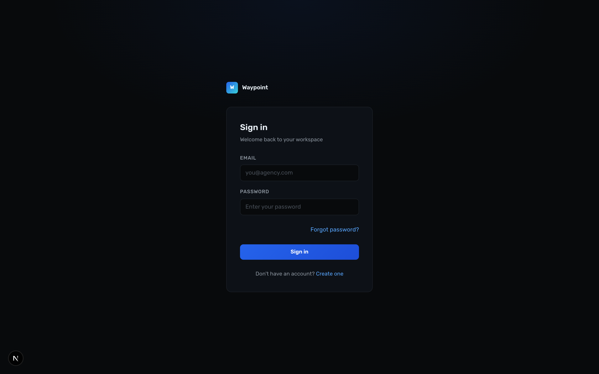

# Audit Summary

**Passed:** 32/35 CSS token checks
**Issues:** 3 warnings/errors
**Info:** 3 informational items

Full report: [DESIGN_AUDIT_REPORT.md](DESIGN_AUDIT_REPORT.md)

## Screenshots
| Page | Status | Screenshot |
|---|---|---|
| [Marketing Landing](/) | ✅ OK |  |
| [Login](/login) | ✅ OK |  |
| [Inbox](/inbox) | ✅ OK |  |
| [Workspace](/workspace) | ✅ OK |  |
| [Settings](/settings) | ✅ OK |  |
| [Itinerary Checker](/itinerary-checker) | ✅ OK |  |
